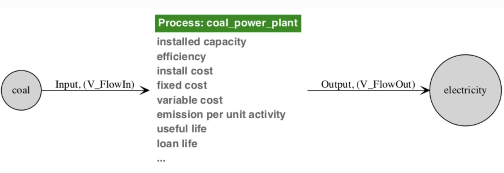

=======
Preface
=======

This manual, in both `PDF`_ and `HTML`_ form, is the official documentation of
Tools for Energy Model Optimization and Analysis (Temoa).  It describes all 
functionality of the Temoa model, and explains the mathematical underpinnings of 
the implemented equations.

Besides this documentation, there are a couple other sources for Temoa-oriented 
information.  The most interactive is the `mailing list`_, and we encourage any
and all questions related to energy system modeling.  Publications are good 
introductory resources, but are not guaranteed to be the most up-to-date as
information and implementations evolve quickly.  As with many software-oriented
projects, even before this manual, `the code is the most definitive resource`.
That said, please let us know (via the `mailing list`_, or other avenue) of any
discrepancies you find, and we will fix it as soon as possible.

What is Temoa?
--------------

Temoa is an energy system optimization model (ESOM).  Briefly, ESOMs optimize the 
installation and utilization of energy technology capacity over a user-defined 
time horizon. Optimal decisions are driven by an objective function that minimizes 
the cost of energy supply. Conceptually, one may think of an ESOM as a "left-to-right" 
network graph, with a set of energy sources on the lefthand side of the graph that 
are transformed into consumable energy commodities by a set of energy technologies, 
which are ultimately used to meet demands on the righthand side of the network graph.
[#esom_definition]_

Key features of the core Temoa model include:

  * Flexible time slicing by season and time-of-day
  * Variable length model time periods
  * Technology vintaging
  * Separate technology loan periods and lifetimes
  * Global and technology-specific discount rates
  * Capability to perform stochastic optimization
  * Capability to perform modeling-to-generate alternatives (MGA)

Temoa design features include:

  * Source code licensed under GPLv2, available through Github [#open_source_realities]_
  * Open source software stack
  * Part of a rich Python ecosystem
  * Data stored in a relational database system (sqlite)
  * Ability to utilize multi-core and compute cluster environments

The word 'Temoa' is actually an acronym for "Tools for Energy Model Optimization
and Analysis," currently composed of four (major) pieces of infrastructure:

   * The mathematical model
   * The implemented model (code)
   * Surrounding tools
   * An online presence

Each of these pieces is fundamental to creating a transparent and usable model
with a community oriented around collaboration.

Why Temoa?
----------

In short, because we believe that ESOM-based analyses should be repeatable by
independent third parties.  The only realistic method to make this happen is to
have a freely available model, and to create an ecosystem of freely shared data
and model inputs.

For a longer explanation, please see :cite:`Hunter_etal_2013` (available from
the `project website <https://temoacloud.com/publications/>`_.  In summary,
ESOM-based analyses are (1) impossible to validate, (2) complex enough as to be
non-repeatable without electronic access to **exact** versions of code *and* data
input, and (3) often do a poor job addressing uncertainty. We believe that
ESOM-based analyses should be completely open, independently reproducible,
electronically available, and address uncertainty about the future.

Temoa Origin and Pronunciation
------------------------------

While we use 'Temoa' as an acronym, it is an actual word in the Nahuatl (Aztec)
language, meaning "to seek something."

.. Figure:: images/temoa_definition.*
   :align: center
   :figclass: center
   :figwidth: 50%

One pronounces the word 'Temoa' as "teh", "moe", "uh". Though TEMOA is an acronym 
for 'Tools for Energy Model Optimization and Analysis', we generally use 'Temoa' 
as a proper noun, and so forgo the need for all-caps. 

Bug Reporting
-------------

Temoa strives for correctness.  Unfortunately, as an energy system model and software
project there are plenty of levels and avenues for error.  If you spot a bug,
inconsistency, or general "that could be improved", we want to hear about it.

If you are a software developer-type, feel free to open an issue on our `GitHub
Issue tracker`_\ .  If you would rather not create a GitHub account, feel free
to let us know the issue on our `mailing list`_\ .

===========
Quick Start
===========

Installing Software Elements
----------------------------

Temoa is implemented in `Pyomo <https://www.pyomo.org/>`_, which is in turn
written in `Python <http://www.python.org/>`_. Consequently, Temoa will run on
Linux, Mac, Windows, or any operating system that Pyomo supports. There are
several open source software elements required to run Temoa. The easiest way to
install these elements is to create a conda environment in which to run the
model. Creating a customized environment ensures that the latest version of
Temoa is compatible with the required software elements. To begin, you need to
have conda installed either via `miniconda
<https://docs.conda.io/en/latest/miniconda.html>`_ or
`anaconda <https://www.anaconda.com/distribution/>`_.
Next, download the `environment.yml
<https://github.com/TemoaProject/temoa/blob/energysystem/environment.yml>`_ file
from our `Github repo <https://github.com/TemoaProject/temoa>`__, and place it in
a new directory named ‘temoa-py3.’ Create this new directory in a location where
you wish to store the environment. Navigate to this directory and execute the
following from the command line:

.. parsed-literal::
  $ conda env create

Then activate the environment as follows:

.. parsed-literal::
  $ conda activate temoa-py3

More information on virtual environments can be found `here
<https://uoa-eresearch.github.io/eresearch-cookbook/recipe/2014/11/20/conda/>`_.
This new conda environment contains several elements, including Python 3, a
compatible version of Pyomo, matplotlib, numpy, scipy, and two free solvers
(`GLPK <https://www.gnu.org/software/glpk/>`_ and `CBC
<https://github.com/coin-or/Cbc>`_). Windows users: the CBC solver is not
available for Windows through conda. Thus, in order to install the environment
properly, the last line of the ‘environment.yml’ file specifying ‘coincbc’
should be deleted. A few notes for on the choice of solvers. Different solvers
have widely varying solution times. If you plan to run Temoa with large datasets
and/or conduct uncertainty analysis, you may want to consider installing
commercial linear solvers such as `CPLEX
<https://www.ibm.com/analytics/cplex-optimizer>`_ or `Gurobi
<https://www.gurobi.com/>`_. Both offer free academic licenses. Another option
is to run CPLEX on the `NEOS <https://neos-server.org/neos/>`_ server.

There are three ways to run the model, each of which is detailed below. Note that
the example commands utilize 'temoa_utopia', a commonly used test case for ESOMs.

Obtaining Temoa
---------------

Now that you have functioning environment, you need to obtain the source code
for Temoa. There are a couple of options for obtaining and running Temoa from
GitHub. If you want to simply run the model, you can download Temoa from GitHub
as a zip file. Navigate to our `Github repo <https://github.com/TemoaProject/temoa>`__,
and click the green ‘clone or download’ button near the top-right corner. Select
‘Download ZIP,’ and you can download the entire Temoa ‘energysystem’ (our main branch)
to your local machine. The second option creates a local copy of the model source
code in our GitHub repository. This is a two step process: first install git and
then ‘clone’ the repository. Under Linux, git can be installed through the default
package manager. Git for Windows and Mac can be downloaded from the `Git website
<https://git-scm.com/download/>`_. To clone the Temoa repository, navigate to
the directory where you want the model to reside and type the following from the
prompt:

.. parsed-literal::
  $ git clone https://github.com/TemoaProject/temoa/

Note that cloning the repository will supply the latest version of the code, and
allow you to archive changes to the code and data in your own local git
repository.

A few basic input data files are included in the ‘temoa/data_files’ folder.
Additional Temoa-compatible datasets are available in `this separate GitHub
repo <https://github.com/TemoaProject/data>`_.

The installation procedures above are meant to be generic and should work across
different platforms. Nonetheless, system-specific ambiguities and unexpected
conditions inevitably arise. Please use the `Temoa forum
<https://groups.google.com/forum/#!forum/temoa-project>`_ to ask for help.

Running Temoa
-------------
The most basic way to run Temoa is with an input data (DAT) file:

.. parsed-literal::
  $ python temoa_model/ /path/to/dat/file

This option will simply run the model and output the results to the shell. To
make sure the model is functioning correctly, try running with the ‘Utopia’
dataset:

.. parsed-literal::
  $ python temoa_model/ data_files/utopia-15.dat

To run the model with more features, use a configuration (‘config’) file. An
example config file called ‘config_sample’ resides within the ‘temoa_model’
folder. Running the model with a config file allows the user to (1) use a sqlite
database for storing input and output data, (2) create a formatted Excel output
file, (2) specify the solver to use, (3) return the log file produced during
model execution, (4) return the lp file utilized by the solver, and (5) to
execute modeling-to-generate alternatives (MGA). Note that if you do not have
access to a commercial solver, it may be faster run cplex on the NEOS server.
To do so, simply specify cplex as the solver and uncomment the ‘–neos’ flag.

.. parsed-literal::
  $ python temoa_model/ --config=temoa_model/config_sample

**For general help, use --help:**

.. parsed-literal::
  $ **python  temoa_model/  --help**
  usage: temoa_model [-h] [--path_to_logs PATH_TO_LOGS] [--config CONFIG]
                     [--solver {bilevel_blp_global,bilevel_blp_local,bilevel_ld,cplex,mpec_minlp,mpec_nlp,openopt,ps} ]
                     [dot_dat [dot_dat ...]]
  
  positional arguments:
    dot_dat               AMPL-format data file(s) with which to create a model
                          instance. e.g. "data.dat"
  
  optional arguments:
    -h, --help            show this help message and exit
    --path_to_logs PATH_TO_LOGS
                          Path to where debug logs will be generated by default.
                          See folder debug_logs in data_files.
    --config CONFIG       Path to file containing configuration information.
    --solver {bilevel_blp_global,bilevel_blp_local,bilevel_ld,cplex,mpec_minlp,mpec_nlp,openopt,ps}
                          Which backend solver to use. See 'pyomo --help-
                          solvers' for a list of solvers with which Pyomo can
                          interface. The list shown here is what Pyomo can
                          currently find on this system. [Default: cplex]

====================================
Database Construction
====================================

Input datasets in Temoa can be constructed either as text files or relational 
databases. Input text files are referred to as 'DAT' files and follow a specific 
format. Take a look at the example DAT files in the :code:`temoa/data_files` 
directory.

While DAT files work fine for small datasets, relational databases are preferred 
for larger datasets. To first order, you can think of a database as a collection 
of tables, where a 'primary key' within each table defines a unique entry (i.e., 
row) within the table. In addition, a 'foreign key' defines a table element drawn 
from another table. Foreign keys enforce the defined relationships between 
different sets and parameters.

Temoa uses `sqlite`_, a widely used, self-contained database 
system. Building a database first requires constructing a sql file, which is 
simply a text file that defines the structure of different database tables and 
includes the input data. The snippet below is from the technology table used to 
define the 'temoa_utopia' dataset:

.. parsed-literal::
  CREATE TABLE technologies (
  tech text primary key,
  flag text,
  sector text,
  tech_desc text,
  tech_category text,
  FOREIGN KEY(flag) REFERENCES technology_labels(tech_labels),
  FOREIGN KEY(sector) REFERENCES sector_labels(sector));
  INSERT INTO "technologies" VALUES('IMPDSL1','r','supply',' imported diesel','petroleum');
  INSERT INTO "technologies" VALUES('IMPGSL1','r','supply',' imported gasoline','petroleum');
  INSERT INTO "technologies" VALUES('IMPHCO1','r','supply',' imported coal','coal');

The first line creates the table. **Lines 2-6** define the columns within this table. 
Note that the the technology ('tech') name defines the primary key. Therefore, the
same technology name cannot be entered twice; each technology name must be unique. 
**Lines 7-8** define foreign keys within the table. For example, each technology 
should be specified with a label (e.g., 'r' for 'resource'). Those labels must 
come from the 'technology_labels' table. Likewise, the sector name must be defined 
in the 'sector_labels' table. This enforcement of names across tables using 
foreign keys helps immediately catch typos. (As you can imagine, typos happen in 
plain text files and Excel when defining thousands of rows of data.) Another big 
advantage of using databases is that the model run outputs are stored in 
separate database output tables. The outputs by model run are indexed by a scenario name, 
which makes it possible to perform thousands of runs, programatically store all 
the results, and execute arbitrary queries that instantaneously return the requested 
data.

Because some database table elements serve as foreign keys in other tables, we 
recommend that you populate input tables in the following order:

**Group 1: labels used for internal database processing**
  * commodity labels: Need to identify which type of commodity. Feel free to change the abbreviations.
  * technology labels: Need to identify which type of technology. Feel free to change the abbreviations.
  * time_period_labels: Used to distinguish which time periods are simply used to specify pre-existing vintages and which represent future optimization periods.

**Group 2: sets used within Temoa**
  * commodities: list of commodities used within the database
  * technologies: list of technologies used within the database
  * time_periods: list of both past and future time periods considered in the database
  * time_season: seasons modeled in the database
  * time_of_day: time of day segments modeled in the database

**Group 3: parameters used to define processes within Temoa**
  * GlobalDiscountRate
  * Demand
  * DemandSpecificDistribution
  * Efficiency
  * ExistingCapacity
  * CapacityFactor
  * CapacityFactorProcess (only if CF varies by vintage; overwrites CapacityFactor)
  * Capacity2Activity
  * CostFixed
  * CostInvest
  * CostVariable
  * EmissionsActivity
  * LifetimeLoanTech
  * LifetimeProcess
  * LifetimeTech

**Group 4: parameters used to define constraints within Temoa**
  * GrowthRateSeed
  * GrowthRateMax
  * MinCapacity
  * MaxCapacity
  * MinActivity
  * MaxActivity
  * RampUp
  * RampDown
  * TechOutputSplit
  * TechInputSplit

For help getting started, take a look at how :code:`data_files/temoa_utopia.sql` is 
constructed. Use :code:`data_files/temoa_schema.sql` (a database file with the requisite 
structure but no data added) to begin building your own database file. We recommend 
leaving the database structure intact, and simply adding data to the schema file.
Once the sql file is complete, you can convert it into a binary sqlite file by 
installing sqlite3 and executing the following command:

.. parsed-literal::
  $ sqlite3 my_database.sqlite < my_database.sql

Now you can specify this database as the source for both input and output data 
in the config file.

=============
Visualization
=============

Network Diagrams
----------------

From the definition of the Temoa model as "an algebraic network of linked
processes," a directed network graph is a natural visualization.  Temoa utilizes
an open source graphics package called `Graphviz`_ to create a series of data-specific and
interactive energy-system maps. Currently, the output graphs consist of a full 
energy system map as well as capacity and activity results per model time period. 
In addition, users can create subgraphs focused on a particular commodity or technology.

The programmatic interaction with Graphviz is entirely text based.  The input files 
created by Temoa for Graphviz provide another means to debug the model and create 
an archive of visualizations for auditing purposes.  In addition, we 
have taken care to make these intermediate files well-formatted.

To utilize graphviz, make sure it is installed on your local machine. Then 
navigate to the :code:`data_processing` folder, where the graphviz script and database
files reside. To review all of the graphviz options, use the :code:`--help` flag:

.. parsed-literal::
  $ python MakeGraphviz.py --help

The most basic way to use graphviz is to view the full energy system map:

.. parsed-literal::
  $ python MakeGraphviz.py -i temoa_utopia.sqlite

The resultant system map will look like this:

.. Figure:: images/simple_model.*
   :align: center
   :figclass: center
   :figwidth: 60%

   This is a map of the simple 'Utopia' system, which we often use for testing 
   purposes. The map shows the possible commodity flows through the system, 
   providing a comprehensive overview of the system. Creating the simple system 
   map is useful for debugging purposes in order to make sure that technologies 
   are linked together properly via commodity flows.

It is also possible to create a system map showing the optimal installed capacity 
and technology flows in a particular model time period. These results are associated 
with a specific model run stored in the model database. To view the results, include 
the scenario flag (:code:`-s`) and a specific model year (:code:`-y`).

.. parsed-literal::
  $ python MakeGraphviz.py -i temoa_utopia.sqlite -s test_run -y 1990

.. figure:: images/global_results.*
   :align: center
   :figclass: center
   :figwidth: 60%

   This graph shows the optimal installed capacity and commodity flows from the 
   'utopia' test system in 2010.

The output can also be fine-tuned to show results associated with a specific 
commodity or technology. For example:

.. parsed-literal::
  $ python MakeGraphviz.py -i dbs/temoa_utopia.sqlite -s test_run -y 2010 -b E31

.. figure:: images/techvintage_results.*
   :align: center
   :figclass: center
   :figwidth: 60%

   In this case, the graph shows the commodity flow in and out of 
   technology 'E31' in 2010, which is from the 'test_run' scenario drawn from the 
   'temoa_utopia' database.

Output Graphs
-------------

Temoa can also be used to generate output graphs using matplotlib 
(https://matplotlib.org/). From the command line, navigate to the :code:`db_io` 
folder and execute the following command:

.. parsed-literal::
  $ python MakeOutputPlots.py --help

The command above will specify all of the flags required to created a stacked bar 
or line plot. For example, consider the following command:

.. parsed-literal::
  $ python MakeOutputPlots.py -i dbs/temoa_utopia.sqlite -s test_run -p capacity -c electric --super

Here is the result:

.. figure:: images/output_flow_example.*
   :align: center
   :figclass: center
   :figwidth: 60%

   This stacked bar plot represents the activity (i.e., output commodity flow) 
   associated with each technology in the electric sector from the 'test_run' 
   scenario drawn from the 'temoa_utopia' database. Because the :code:`super` 
   flag was specified, technologies are grouped together based on user-specified 
   categories in the 'tech_category' column of the 'technologies' table of the 
   database.

=====================
The Math Behind Temoa
=====================

   To understand this section, the reader will need at least a cursory
   understanding of mathematical optimization.  We omit here that introduction,
   and instead refer the reader to `various`_ `available`_ `online`_ `sources`_.
   Temoa is formulated as an algebraic model that requires information organized 
   into sets, parameters, variables, and equation
   definitions.

The heart of Temoa is a technology explicit energy system optimization model.
It is an algebraic network of linked processes -- understood by the model as a
set of engineering characteristics (e.g. capital cost, efficiency, capacity
factor, emission rates) -- that transform raw energy sources into end-use
demands.  The model objective function minimizes the present-value cost of
energy supply by optimizing installed capacity and its utilization over time.

.. _simple_system:

.. figure:: images/simple_system2.*
   :align: center
   :width: 100%
   :alt: A simple energy system, with energy sources on the left and energy
         sinks (end-use demands) on the right.
   :figclass: align-center
   :figwidth: 70%

   A common visualization of energy system models is a directed network graph, with energy
   sources on the left and end-use demands on the right.  The modeler must
   specify the specific end-use demands to be met, the technologies of the
   system (rectangles), and the inputs and outputs of each (red and green
   arrows).  The circles represent distinct types of energy carriers.

The most fundamental tenet of the model is the understanding of energy flow,
treating all processes as black boxes that take inputs and produce outputs.
Specifically, Temoa does not care about the inner workings of a process, only
its global input and output characteristics.  In this vein, the above graphic
can be broken down into process-specific elements.  For example, the coal power plant
takes as input coal and produces electricity, and is subject to various costs
(e.g. variable costs) and constraints (e.g. efficiency) along the way.

The modeler defines the processes and engineering characteristics through an
amalgam of sets and parameters, described in the next few sections.  Temoa then
translates these into variables and constraints that an optimizer may then
solve.

.. _Sets:

Conventions
-----------

 * In the mathematical notation, we use CAPITALIZATION to denote a container,
   like a set, indexed variable, or indexed parameter.  Sets use only a single
   letter, so we use the lower case to represent an item from the set.  For
   example, :math:`T` represents the set of all technologies and :math:`t`
   represents a single item from :math:`T`.

 * Variables are named V\_VarName within the code to aid readability.  However,
   in the documentation where there is benefit of italics and other font
   manipulations, we elide the 'V\_' prefix.

 * In all equations, we **bold** variables to distinguish them from parameters.
   Take, for example, this excerpt from the Temoa default objective function:

   .. math::
      C_{variable} = \sum_{p, s, d, i, t, v, o \in \Theta_{VC}} \left (
              {VC}_{p, t, v}
        \cdot R_p
        \cdot \textbf{FO}_{p, s, d, i, t, v, o}
        \right )

   Note that :math:`C_{variable}` is not bold, as it is a temporary variable
   used for clarity while constructing the objective function.  It is not a
   structural variable and the solver never sees it.

 * Where appropriate, we put the variable on the right side of the coefficient.
   In other words, this is not a preferred form of the previous equation:

   .. math::

      C_{variable} = \sum_{p, s, d, i, t, v, o \in \Theta_{VC}} \left (
              \textbf{FO}_{p, s, d, i, t, v, o}
        \cdot {VC}_{p, t, v}
        \cdot R_p
        \right )

 * We generally put the limiting or defining aspect of an equation on the right
   hand side of the relational operator, and the aspect being limited or defined
   on the left hand side.  For example, equation :eq:`Capacity` defines Temoa's
   mathematical understanding of a process capacity (:math:`\textbf{CAP}`) in
   terms of that process' activity (:math:`\textbf{ACT}`):

   .. math::

       \left (
               \text{CFP}_{t, v}
         \cdot \text{C2A}_{t}
         \cdot \text{SEG}_{s, d}
         \cdot \text{TLF}_{p, t, v}
       \right )
       \cdot \textbf{CAP}_{t, v}
       =
       \sum_{I, O} \textbf{FO}_{p, s, d,i, t, v, o}
       +
       \sum_{I, O} \textbf{CUR}_{p,s,d,i,t,v,o}

       \\
       \forall \{p, s, d, t, v\} \in \Theta_{\text{FO}}

 * We use the word 'slice' to refer to the tuple of season and time of day
   :math:`\{s,d\}`. For example, "winter-night".

 * We use the word 'process' to refer to the tuple of technology and vintage
   (:math:`\{t,v\}`), when knowing the vintage of a process is not pertinent
   to the context at hand.

   * In fact, in contrast to most other ESOMs, Temoa is "process centric."
     This is a fairly large conceptual difference that we explain in detail in
     the rest of the documentation.  However, it is a large enough point that
     we make it here for even the no-time quick-start modelers: think in terms
     of "processes" while modeling, not "technologies and start times".

 * Mathematical notation:

   * We use the symbol :math:`\mathbb{I}` to represent the unit interval ([0,
     1]).

   * We use the symbol :math:`\mathbb{Z}` to represent "the set of all
     integers."

   * We use the symbol :math:`\mathbb{N}` to represent natural numbers (i.e.,
     integers greater than zero: 1, 2, 3, :math:`\ldots`).

   * We use the symbol :math:`\mathbb{R}` to denote the set of real numbers, and
     :math:`\mathbb{R}^+_0` to denote non-negative real numbers.

Sets
----

.. _table_set:

.. csv-table:: List of all Temoa sets with which a modeler might interact.  The
             asterisked (\*) elements are automatically derived by the model and
             are not user-specifiable.
   :header: "Set","Temoa Name","Data Type","Short Description"
   :widths: 8, 28, 14, 50

   ":math:`{}^*\text{C}`",":code:`commodity_all`","string","union of all commodity sets"
   ":math:`\text{C}^d`",":code:`commodity_demand`","string","end-use demand commodities"
   ":math:`\text{C}^e`",":code:`commodity_emissions`","string","emission commodities (e.g. :math:`\text{CO}_\text{2}`, :math:`\text{NO}_\text{x}`)"
   ":math:`\text{C}^p`",":code:`commodity_physical`","string","general energy forms (e.g. electricity, coal, uranium, oil)"
   ":math:`{}^*\text{C}^c`",":code:`commodity_carrier`","string","physical energy carriers and end-use demands (:math:`\text{C}_p \cup \text{C}_d`)"
   ":math:`\text{I}`",,"string","alias of :math:`\text{C}_p`; used in documentation only to mean ""input"""
   ":math:`\text{O}`",,"string","alias of :math:`\text{C}_c`; used in documentation only to mean ""output"""
   ":math:`\text{P}^e`",":code:`time_existing`",":math:`\mathbb{Z}`","model periods before optimization begins"
   ":math:`\text{P}^f`",":code:`time_future`",":math:`\mathbb{Z}`","model time scale of interest; the last year is not optimized"
   ":math:`{}^*\text{P}^o`",":code:`time_optimize`",":math:`\mathbb{Z}`","model time periods to optimize; (:math:`\text{P}^f - \text{max}(\text{P}^f)`)"
   ":math:`{}^*\text{V}`",":code:`vintage_all`",":math:`\mathbb{Z}`","possible tech vintages; (:math:`\text{P}^e \cup \text{P}^o`)"
   ":math:`\text{S}`",":code:`time_season`","string","seasonal divisions (e.g. winter, summer)"
   ":math:`\text{D}`",":code:`time_of_day`","string","time-of-day divisions (e.g. morning)"
   ":math:`{}^*\text{T}`",":code:`tech_all`","string","all technologies to be modeled; (:math:`{T}^r \cup {T}^p`)"
   ":math:`\text{T}^r`",":code:`tech_resource`","string","resource extraction techs"
   ":math:`\text{T}^p`",":code:`tech_production`","string","techs producing intermediate commodities"
   ":math:`\text{T}^b`",":code:`tech_baseload`","string","baseload electric generators; (:math:`{T}^b \subset T`)"
   ":math:`\text{T}^m`",":code:`tech_ramp`","string","electric generators with a ramp rate limit; (:math:`{T}^m \subset T`)"
   ":math:`\text{T}^e`",":code:`tech_reserve`","string","electric generators contributing to the reserve margin requirement; (:math:`{T}^e \subset T`)"
   ":math:`\text{T}^s`",":code:`tech_storage`","string","storage technologies; (:math:`{T}^s \subset T`)"
   ":math:`\text{T}^c`",":code:`tech_curtailment`","string","technologies with curtailable output and no upstream cost; (:math:`{T}^c \subset T`)"
   ":math:`\text{T}^a`",":code:`tech_annual`","string","technologies that produce constant annual output; (:math:`{T}^a \subset T`)" 
   ":math:`\text{T}^{cmax}`",":code:`tech_capacity_max`","string","subset of technologies used in MaxCapacitySet constraint; (:math:`{T}^{cmax} \subset T`)"
   ":math:`\text{T}^{cmin}`",":code:`tech_capacity_min`","string","subset of technologies used in MinCapacitySet constraint; (:math:`{T}^{cmin} \subset T`)"

Temoa uses two different set notation styles, one for code representation and
one that utilizes standard algebraic notation.  For brevity, the mathematical
representation uses capital glyphs to denote sets, and small glyphs to represent
items within sets.  For example, :math:`T` represents the set of all
technologies and :math:`t` represents an item within :math:`T`.

The code representation is more verbose than the algebraic version, using full
words.  This documentation presents them in an italicized font.  The same
example of all technologies is represented in the code as :code:`tech_all`.
Note that regardless, the meanings are identical, with only minor interaction
differences inherent to "implementation details."  :ref:`Table 1 <table_set>`
lists all of the Temoa sets, with both notational schemes.

Their are four basic set "groups" within Temoa: periods, annual "slices",
technology, and energy commodities.  The technological sets contain all the
possible energy technologies that the model may build and the commodities sets
contain all the input and output forms of energy that technologies consume and
produce.  The period and slice sets merit a slightly longer discussion.

Temoa's conceptual model of *time* is broken up into three levels:

 * **Periods** - consecutive blocks of years, marked by the first year in the
   period.  For example, a two-period model might consist of :math:`\text{P}^f =
   \{2010, 2015, 2025\}`, representing the two periods of years from 2010
   through 2014, and from 2015 through 2024.

 * **Seasonal** - Each year may have multiple seasons.  For example, winter
   might demand more heating, while spring might demand more cooling and
   transportation.

 * **Daily** - Within a season, a day might have various times of interest.
   For instance, the peak electrical load might occur midday in the summer, and
   a secondary peak might happen in the evening.

There are two specifiable period sets: :code:`time_exist` (:math:`\text{P}^e`)
and :code:`time_future` (:math:`\text{P}^f`).  The :code:`time_exist` set
contains periods before :code:`time_future`.  Its primary purpose is to specify
the vintages for capacity that exist prior to the model optimization.  (This is
part of Temoa's answer to what most other efforts model as "residual capacity".)
The :code:`time_future` set contains the future periods that the model will
optimize.  As this set must contain only integers, Temoa interprets the elements
to be the boundaries of each period of interest.  Thus, this is an ordered set
and Temoa uses its elements to automatically calculate the length of each
optimization period; modelers may exploit this to create variable period lengths
within a model. Temoa "names" each optimization period by the first year, and
makes them easily accessible via the :code:`time_optimize` set.  This final
"period" set is not user-specifiable, but is an exact duplicate of
:code:`time_future`, less the largest element.  In the above example, since
:math:`\text{P}^f = \{2010, 2015, 2025\}`, :code:`time_optimize` does not
contain 2025: :math:`\text{P}^o =\{2010, 2015\}`.

One final note on periods: rather than optimizing each year within a period
individually, Temoa makes a simplifying assumption that each period contains
:math:`n` copies of a single, representative year.  Temoa optimizes just this
characteristic year, and only delineates each year within a period through a
time-value of money calculation in the objective function.  Figure 3.3 gives a
graphical explanation of the annual delineation.

.. _FigureObjectiveComparison:

.. figure:: images/ObjectiveUsageVsCostComparison.png
   :align: center
   :width: 100%
   :alt: Energy use same each year; time-value of annual costs reduced each year
   :figclass: align-center
   :figwidth: 60%

   The left graph is of energy, while the right graph is of the annual costs.
   In other words, the energy used in a period by a process is the same for all
   years (with exception for those processes that cease their useful life
   mid-period).  However, even though the costs incurred will be the same, the
   time-value of money changes due to the discount-rate.  As the fixed costs of
   a process are tied to the length of its useful life, those processes that do
   not fall on a period boundary require unique time-value multipliers in the
   objective function.

Many model-based analyses require sub-annual variations in demand as well.  Temoa
allows the modeler to subdivide years into slices, comprised of a season and a
time of day (e.g.  winter evening).  Unlike the periods, there is no restriction
on what labels the modeler may assign to the :code:`time_season` and
:code:`time_of_day` set elements.  

A Word on Index Ordering
^^^^^^^^^^^^^^^^^^^^^^^^

The ordering of the indices is consistent throughout the model to promote an
intuitive "left-to-right" description of each parameter, variable, and
constraint set.  For example, Temoa's output commodity flow variable
:math:`FO_{p,s,d,i,t,v,o}` may be described as "in period (:math:`p`) during
season (:math:`s`) at time of day (:math:`d`), the flow of input commodity
(:math:`i`) to technology (:math:`t`) of vintage (:math:`v`) generates an output
commodity flow (:math:`o`) of :math:`FO_{p,s,d,i,t,v,o}`."  For any indexed
parameter or variable within Temoa, our intent is to enable a mental model of a
left-to-right arrow-box-arrow as a simple mnemonic to describe the "input
:math:`\rightarrow` process :math:`\rightarrow` output" flow of energy.  And
while not all variables, parameters, or constraints have 7 indices, the 7-index
order mentioned here (p, s, d, i, t, v, o) is the canonical ordering.  If you
note any case where, for example, d comes before s, that is an oversight.  In
general, if there is an index ordering that does not follow this rubric, we view
that as a bug.

Deviations from Standard Mathematical Notation
^^^^^^^^^^^^^^^^^^^^^^^^^^^^^^^^^^^^^^^^^^^^^^

Temoa deviates from standard mathematical notation and set understanding in two
ways.  The first is that Temoa places a restriction on the *time* set elements.
Specifically, while most optimization programs treat set elements as arbitrary
labels, Temoa assumes that all elements of the :code:`time_existing` and
:code:`time_future` sets are integers.  Further, these sets are assumed to be
ordered, such that the minimum element is "naught".  For example, if
:math:`\text{P}^f = \{2015, 2020, 2030\}`, then :math:`P_0 = 2015`.  In
other words, the capital :math:`\text{P}` with the naught subscript indicates
the first element in the :code:`time_future` set.  We will explain the reason
for this deviation shortly.

The second set of deviations revolves around the use of the Theta superset
(:math:`\Theta`).  The Temoa code makes heavy use of sparse sets, for both
correctness and efficient use of computational resources.  For brevity, and
to avoid discussion of some "implementation details," we do not enumerate their
logical creation here.  Instead, we rely on the readers general understanding of
the context.  For example, in the sparse creation of the constraints of the
Demand constraint class (explained in :ref:`NetworkConstraints` and
:ref:`constraint-anatomy`), we state simply that the constraint is instantiated
"for all the :math:`\{p, s, d, dem\}` tuples in
:math:`\Theta_{\text{demand}}`".  This means that the constraint is only defined
for the exact indices for which the modeler specified end-use demands via the
Demand parameter.

Summations also occur in a sparse manner.  For example, let's take another look at
the :code:`Capacity` :eq:`Capacity` Constraint:

.. math::

       \left (
               \text{CFP}_{t, v}
         \cdot \text{C2A}_{t}
         \cdot \text{SEG}_{s, d}
         \cdot \text{TLF}_{p, t, v}
       \right )
       \cdot \textbf{CAP}_{t, v}
   =
       \sum_{I, O} \textbf{FO}_{p, s, d,i, t, v, o}
       +
       \sum_{I, O} \textbf{CUR}_{p,s,d,i,t,v,o}

   \\
   \forall \{p, s, d, t, v\} \in \Theta_{\text{Capacity}}

It defines the Capacity variable for every valid combination of :math:`\{p, v\}`,
and includes the sum over all inputs and outputs of the FlowOut variable.  A
naive implementation of this equation might include nonsensical items in each
summation, such as an input of vehicle miles traveled and an output of
sunlight for a wind powered turbine.  However, in this context, summing over the
inputs and outputs (:math:`i` and :math:`o`) implicitly includes only the valid
combinations of :math:`\{p, s, d, i, t, v, o\}`.

Parameters
----------

.. _table_parameter:

.. csv-table:: List of Temoa parameters with which a modeler might interact.
           The asterisked (\*) elements are automatically derived by the model
           and are not user-specifiable.
   :header: "Parameter","Temoa Name","Domain","Short Description"
   :widths: 14, 27, 10, 49

   ":math:`\text{CFT}_{s,d,t}`","CapacityFactorTech",":math:`\mathbb{I}`","Technology-specific capacity factor"
   ":math:`\text{CFD}_{s,d,t,v}`","CapacityFactorProcess",":math:`\mathbb{I}`","Process-specific capacity factor"
   ":math:`\text{C2A}_{t,v}`","Capacity2Activity",":math:`\mathbb{R}^+_0`","Converts from capacity to activity units"
   ":math:`\text{FC}_{p,t,v}`","CostFixed",":math:`\mathbb{R}`","Fixed operations \& maintenance cost"
   ":math:`\text{IC}_{t,v}`","CostInvest",":math:`\mathbb{R}`","Tech-specific investment cost"
   ":math:`\text{MC}_{p,t,v}`","CostVariable",":math:`\mathbb{R}`","Variable operations \& maintenance cost"
   ":math:`\text{DEM}_{p,c}`","Demand",":math:`\mathbb{R}^+_0`","End-use demands, by period"
   ":math:`\text{DDD}_{p,s,d}`","DemandDefaultDistribution",":math:`\mathbb{I}`","Default demand distribution"
   ":math:`\text{DSD}_{p,s,d,c}`","DemandSpecificDistribution",":math:`\mathbb{I}`","Demand-specific distribution"
   ":math:`\text{DR}_t`","DiscountRate",":math:`\mathbb{R}`","Tech-specific interest rate on investment"
   ":math:`\text{EFF}_{i,t,v,o}`","Efficiency",":math:`\mathbb{R}^+_0`","Tech- and commodity-specific efficiency"
   ":math:`\text{EAC}_{i,t,v,o,e}`","EmissionsActivity",":math:`\mathbb{R}`","Tech-specific emissions rate"
   ":math:`\text{ELM}_{p,e}`","EmissionsLimit",":math:`\mathbb{R}^+_0`","Emissions limit by time period"
   ":math:`\text{ECAP}_{t,v}`","ExistingCapacity",":math:`\mathbb{R}^+_0`","Pre-existing capacity"
   ":math:`\text{GDR}`","GlobalDiscountRate",":math:`\mathbb{R}`","Global rate used to calculate present cost"
   ":math:`\text{GRM}`","GrowthRateMax",":math:`\mathbb{R}`","Global rate used to calculate present cost"
   ":math:`\text{GRS}`","GrowthRateSeed",":math:`\mathbb{R}`","Global rate used to calculate present cost"
   ":math:`\text{LLN}_{t,v}`","LifetimeLoanProcess",":math:`\mathbb{N}`","Tech- and vintage-specific loan term"
   ":math:`\text{LTC}_{p,t,v}`","LifetimeTech",":math:`\mathbb{N}`","Tech- and vintage-specific lifetime"
   ":math:`\text{MAX}_{p,t}`","MaxCapacity",":math:`\mathbb{R}^+_0`","maximum tech-specific capacity by period"
   ":math:`\text{MIN}_{p,t}`","MinCapacity",":math:`\mathbb{R}^+_0`","minimum tech-specific capacity by period"
   ":math:`\text{RSC}_{p,c}`","ResourceBound",":math:`\mathbb{R}^+_0`","Upper bound on resource use"
   ":math:`\text{SD}_{t}`","StorageDuration",":math:`\mathbb{N}`","Storage duration per technology specified in hours"
   ":math:`\text{SEG}_{s,d}`","SegFrac",":math:`\mathbb{I}`","Fraction of year represented by each (s, d) tuple"
   ":math:`\text{SIF}_{t}`","StorageInitFrac",":math:`\mathbb{I}`","Initial storage charge level expressed as fraction of full charge"
   ":math:`\text{TIS}_{i,t}`","TechInputSplit",":math:`\mathbb{I}`","Technology input fuel ratio"
   ":math:`\text{TOS}_{t,o}`","TechOutputSplit",":math:`\mathbb{I}`","Technology output fuel ratio"
   ":math:`{}^*\text{LA}_{t,v}`","LoanAnnualize",":math:`\mathbb{R}^+_0`","Loan amortization by tech and vintage; based on :math:`DR_t`"
   ":math:`{}^*\text{MLL}_{t,v}`","ModelLoanLife",":math:`\mathbb{N}`","Smaller of model horizon or process loan life"
   ":math:`{}^*\text{MPL}_{p,t,v}`","ModelTechLife",":math:`\mathbb{N}`","Smaller of model horizon or process tech life"
   ":math:`{}^*\text{LEN}_p`","PeriodLength",":math:`\mathbb{N}`","Number of years in period :math:`p`"
   ":math:`{}^*\text{R}_p`","PeriodRate",":math:`\mathbb{R}`","Converts future annual cost to discounted period cost"
   ":math:`{}^*\text{TLF}_{p,t,v}`","TechLifetimeFrac",":math:`\mathbb{I}`","Fraction of last time period that tech is active"

.. _influential_efficiency:

Efficiency
^^^^^^^^^^

:math:`{EFF}_{i \in C_p,t \in T,v \in V,o \in C_c}`

We present the efficiency (:math:`EFF`) parameter first as it is one of the most
critical model parameters.  Beyond defining the conversion efficiency of each
process, Temoa also utilizes the indices to understand the valid input 
:math:`\rightarrow` process :math:`\rightarrow` output paths for energy. For
instance, if a modeler does not specify an efficiency for a 2020 vintage coal
power plant, then Temoa will recognize any mention of a 2020 vintage coal power
plant elsewhere as an error. Generally, if a process is not specified in the
efficiency table,\ [#efficiency_table]_ Temoa assumes it is not a valid process
and will provide the user a warning with pointed debugging information.

.. _CapacityFactorTech:

CapacityFactorTech
^^^^^^^^^^^^^^^^^^

:math:`{CFT}_{s \in S, d \in D, t \in T}`

Temoa indexes the :code:`CapacityFactorTech` parameter by season, time-of-day,
and technology.

CapacityFactorProcess
^^^^^^^^^^^^^^^^^^^^^

:math:`{CF}_{s \in S, d \in D, t \in T, v \in V}`

In addition to :ref:`CapacityFactorTech`, there may be cases where different
vintages of the same technology have different capacity factors. For example,
newer vintages of wind turbines may have higher capacity factors. So , 
:code:`CapacityFactorProcess` allows users to specify the capacity factor by
season, time-of-day, technology, and vintage.

Capacity2Activity
^^^^^^^^^^^^^^^^^

:math:`{C2A}_{t \in T}`

Capacity and Activity are inherently two different units of measure.  Capacity
represents the maximum flow of energy per time (:math:`\frac{energy}{time}`),
while Activity is a measure of total energy actually produced. However, there are
times when one needs to compare the two, and this parameter makes those
comparisons more natural.  For example, a capacity of 1 GW for one year works
out to an activity of

.. math::

   {1 GW} \cdot {8,760 \tfrac{hr}{yr}} \cdot {3,600 \tfrac{sec}{hr}} \cdot
      {10^{-6} \tfrac{P}{G}} = {31.536 \tfrac{PJ}{yr}}

.. centered::
   or

.. math::

   {1 GW} \cdot {8,760 \tfrac{hr}{yr}} \cdot {10^{-3} \tfrac{T}{G}} = {8.75 TWh}

When comparing one capacity to another, the comparison is easy, unit wise.
However, when one *needs* to compare capacity and activity, how does one
reconcile the units?  One way to think about the utility of this parameter is in
the context of the question: "How much activity would this capacity create, if
used 100% of the time?"

CostFixed
^^^^^^^^^

:math:`{FC}_{p \in P,t \in T,v \in V}`

The :code:`CostFixed` parameter specifies the fixed cost associated with any
process.  Fixed costs are those that must be paid, regardless of how much the
process is utilized.  For instance, if the model decides to build a nuclear
power plant, even if it decides not utilize the plant, the model must pay the
fixed costs. These costs are in addition to the capital cost, so once the
capital is paid off, these costs are still incurred every year the process
exists.

Temoa's default objective function assumes the modeler has specified this
parameter in units of currency per unit capacity (:math:`\tfrac{Dollars}{Unit
Cap}`).

CostInvest
^^^^^^^^^^

:math:`{IC}_{t \in T,v \in P}`

The :code:`CostInvest` parameter specifies the process-specific investment cost.
Unlike the :code:`CostFixed` and :code:`CostVariable` parameters,
:code:`CostInvest` only applies to vintages of technologies within the model
optimization horizon (:math:`\text{P}^o`).  Like :code:`CostFixed`, 
:code:`CostInvest` is specified in units of cost per unit of capacity and is
only used in the default objective function (:math:`\tfrac{Dollars}{Unit Cap}`).

CostVariable
^^^^^^^^^^^^

:math:`{MC}_{p \in P,t \in T,v \in V}`

The :code:`CostVariable` parameter represents the cost of a process-specific unit
of activity. Thus the incurred variable costs are proportional to the activity
of the process.

.. _Demand:

Demand
^^^^^^

:math:`{DEM}_{p \in P,c \in C^d}`

The :code:`Demand` parameter allows the modeler to define the total end-use
demand levels for all periods.  In combination with the :code:`Efficiency`
parameter, this parameter is the most important because without it, the rest of
model has no incentive to build anything.  This parameter specifies the end-use
demands that appear at the far right edge of the system diagram.

To specify the distribution of demand, look to the
:code:`DemandDefaultDistribution` (DDD) and :code:`DemandSpecificDistribution`
(DSD) parameters.

As a historical note, this parameter was at one time also indexed by season and
time of day, allowing modelers to specify exact demands for every time slice.
However, while extremely flexible, this proved too tedious to maintain for any
data set of appreciable size.  Thus, we implemented the DDD and DSD parameters.

.. _DDD:

DemandDefaultDistribution
^^^^^^^^^^^^^^^^^^^^^^^^^

:math:`{DDD}_{s \in S, d \in D}`

By default, Temoa assumes that end-use demands (:ref:`Demand`) are evenly
distributed throughout a year.  In other words, the Demand will be apportioned
by the :code:`SegFrac` parameter via:

.. math::

   \text{EndUseDemand}_{s, d, c} = {SegFrac}_{s, d} \cdot {Demand}_{p, c}

Temoa enables this default action by automatically setting DDD equivalent to
:code:`SegFrac` for all seasons and times of day.  If a modeler would like a
different default demand distribution, the modeler must specify any indices of
the DDD parameter.  Like the :ref:`SegFrac` parameter, the sum of DDD must be 1.

DemandSpecificDistribution
^^^^^^^^^^^^^^^^^^^^^^^^^^

:math:`{DSD}_{s \in S, d \in D, c \in C^d}`

If there is an end-use demand that varies over the course of a day or across
seasons -- for example, heating or cooling in the summer or winter -- the 
modeler may specify the fraction of annual demand occurring in each time slice.
Like :ref:`SegFrac` and :ref:`DDD`, the sum of DSD for each :math:`c` must be 1.
If the modeler does not define DSD for a season, time of day, and demand 
commodity, Temoa automatically populates this parameter according to DDD.
It is this parameter that is actually multiplied by the :code:`Demand` parameter
in the Demand constraint.

DiscountRate
^^^^^^^^^^^^

:math:`{DR}_{t \in T}`

In addition to the :code:`GlobalDiscountRate`, a modeler may also specify a
technology-specific discount rate.  If not specified, this rate defaults to 0.05.

EmissionActivity
^^^^^^^^^^^^^^^^^

:math:`{EAC}_{e \in C_e,\{i,t,v,o\} \in \Theta_{\text{efficiency}}}`

Temoa currently has two methods for enabling a process to produce an output: the
:code:`Efficiency` parameter, and the :code:`EmissionActivity` parameter.  Where
the :code:`Efficiency` parameter defines the amount of output energy a process
produces per unit of input, the :code:`EmissionActivity` parameter allows for
secondary outputs.  As the name suggests, this parameter was originally intended
to account for emissions per unit activity, but it more accurately describes
*parallel* activity.  It is restricted to emissions accounting (by the 
:math:`e \in C^e` set restriction).

EmissionLimit
^^^^^^^^^^^^^^

:math:`{ELM}_{p \in P, e \in C^e}`

The :code:`EmissionLimit` parameter ensures that Temoa finds a solution that
fits within the modeler-specified limit of emission :math:`e` in time period
:math:`p`.

ExistingCapacity
^^^^^^^^^^^^^^^^

:math:`{ECAP}_{t \in T, v \in \text{P}^e}`

In contrast to some competing models, technologies in Temoa can have
vintage-specific characteristics within the same period.  Thus, Temoa treats
existing technological capacity as processes, requiring all of the engineering
characteristics of a standard process, with the exception of an investment cost.

.. _GDR:

GlobalDiscountRate
^^^^^^^^^^^^^^^^^^

:math:`{GDR}`

Because Temoa is a capacity expansion model, it must account for the time value
of money. The future value (FV) of a sum of currency is related to the net\
present value (NPV) via the formula:

.. math::

   \text{FV} = \text{NPV} \cdot {(1 + GDR)^n}

where :math:`n` is in years.  This parameter is only used in Temoa's objective
function.

LifetimeLoan
^^^^^^^^^^^^

:math:`{LLN}_{t \in T,v \in P}`

Temoa gives the modeler the ability to separate the loan lifetime from the
useful life of the technology.  This parameter specifies the length of the loan
associated with investing in a process, in years.  If not specified, the default
is 10 years.

LifetimeTech
^^^^^^^^^^^^

:math:`{LTC}_{p \in P,t \in T,v \in V}`

Similar to LifetimeLoan, this parameter specifies the total useful life of a
given technology in years.  If not specified, the default is 30 years.

.. _ParamMaxCapacity:

MaxCapacity
^^^^^^^^^^^

:math:`{MAX}_{p \in P,t \in T}`

The MaxCapacity parameter enables a modeler to ensure that a certain technology
is constrained to an upper bound capacity. The constraint ensures that the max
total capacity (summed across vintages) of a technology class is under this
maximum. That is, all active vintages are constrained. This parameter is used
only in the :ref:`maximum capacity constraint <MaxCapacity_Constraint>`.

MinCapacity
^^^^^^^^^^^

:math:`{MIN}_{p \in P,t \in T}`

The MinCapacity parameter is analogous to the :ref:`MaxCapacity parameter
<ParamMaxCapacity>`, except that it specifies the minimum capacity for
which Temoa must ensure installation.

ResourceBound
^^^^^^^^^^^^^

:math:`{RSC}_{p \in P,c \in C_p}`

This parameter allows the modeler to specify resources to constrain per period.
Note that a constraint in one period does not relate to any other periods.  For
instance, if the modeler specifies a limit in period 1 and does not specify a
limit in period 2, then the model may use as much of that resource as it would
like in period 2.

.. _SegFrac:

SegFrac
^^^^^^^

:math:`{SEG}_{s \in S,d \in D}`

The :code:`SegFrac` parameter specifies the fraction of the year represented by
each combination of season and time of day.  The sum of all combinations within
:code:`SegFrac` must be 1, representing 100% of a year.

StorageInitFrac
^^^^^^^^^^^^^^^

:math:`{SI}_{t \in T^{S}}`

The :code:`StorageInitFrac` parameter determines the initial charge level associated
with each storage technology. The value should be expressed as a fraction between
0 and 1. Note that this is an optional parameter and should only be used if the
user wishes to set the initial charge rather than allowing the model to optimize it.

StorageDuration
^^^^^^^^^^^^^^^

:math:`{SD}_{t \in T^{S}}`

The :code:`StorageDuration` parameter represents the number of hours over which
storage can discharge if it starts at full charge and produces maximum output
until empty.

TechInputSplit
^^^^^^^^^^^^^^

:math:`{SPL}_{i \in C_p, t \in T}`

Some technologies have a single output but have multiple input fuels. Some
technologies require fixed shares of input. See the :ref:`TechOutputSplit
constraint <TechOutputSplit_Constraint>` for the implementation concept.

TechOutputSplit
^^^^^^^^^^^^^^^

:math:`{SPL}_{t \in T, o \in C_c}`

Some technologies have a single input fuel but have multiple outputs. For the
sake of modeling, certain technologies require fixed shares of output. For
example, an oil refinery might have an input energy of crude oil, and the
modeler wants to ensure that its output is 70% diesel and 30% gasoline. See the
:ref:`TechOutputSplit constraint <TechOutputSplit_Constraint>` for the
implementation details.

\*LoanAnnualize
^^^^^^^^^^^^^^^

:math:`{LA}_{t \in T,v \in P}`

This is a model-calculated parameter based on the process-specific loan length
(it's indices are the same as the :code:`LifetimeLoan` parameter), and
process-specific discount rate (the :code:`DiscountRate` parameter).  It is
calculated via the formula:

.. math::

   LA_{t,v} = \frac{DR_{t,v}}{1 - (1 + DR_{t,v})^{{}^- LLN_{t,v}}}

   \forall \{t, v\} \in \Theta_\text{CostInvest}

\*PeriodLength
^^^^^^^^^^^^^^

:math:`{LEN}_{p \in P}`

Given that the modeler may specify arbitrary time period boundaries, this
parameter specifies the number of years contained in each period. The final year
is the largest element in :code:`time_future` which is specifically not included
in the list of periods in :code:`time_optimize` (:math:`\text{P}^o`). The length
calculation for each period then exploits the fact that the ``time`` sets are
ordered:

.. math::

   \text{LET boundaries} & = \text{sorted}(\text{P}^f) \\
   \text{LET I(p)} & = \text{index of p in boundaries} \\
   & \therefore \\
   {LEN}_p & = \text{boundaries}[ I(p) + 1 ] - p

   \forall p \in P

The first line creates a sorted array of the period boundaries, called
*boundaries*.  The second line defines a function `I` that finds the index of
period :math:`p` in boundaries. The third line then defines the length of period
:math:`p` to be the number of years between period :math:`p` and the next
period.  For example, if :math:`\text{P}^f = \{2015, 2020, 2030, 2045\}`,
then *boundaries* would be :code:`[2015, 2020, 2030, 2045]`.  For 2020, I(2020)
would return 2.  Similarly, boundaries[ 3 ] = 2030.  Then,

.. math::
   {LEN}_{2020} & = \text{boundaries}[I(2020) + 1] - (2020) \\
   & = \text{boundaries} [2 + 1] - 2020                     \\
   & = \text{boundaries} [3] - 2020                         \\
   & = 2030 - 2020                                          \\
   & = 10

Note that LEN is only defined for elements in :math:`\text{P}^o`, and is
specifically not defined for the final element in :math:`\text{P}^f`.

\*PeriodRate
^^^^^^^^^^^^

:math:`R_{p \in P}`

Temoa optimizes a single characteristic year within a period, and differentiates
the :math:`n` copies of that single year solely by the appropriate discount
factor.  Rather than calculating the same summation for every technology and
vintage within a period, we calculate it once per period and lookup the sum as
necessary during the objective function generation.  The formula is the sum of
discount factors corresponding to each year within a period:

.. math::

   R_p = \sum_{y = 0}^{{LEN}_p} \frac{1}{{(1 + GDR)}^{(P_0 - p - y)}}

   \\
   \forall p \in P

Note that this parameter is the implementation of the single "characteristic
year" optimization per period concept discussed in the :ref:`Sets` section.

\*ProcessLifeFrac
^^^^^^^^^^^^^^^^^

:math:`{TLF}_{p \in P,t \in T,v \in V}`

The modeler may specify a useful lifetime of a process such that the process
will be decommissioned part way through a period.  Rather than attempt to
delineate each year within that final period, Temoa makes the choice to average
the total output of the process over the entire period but limit the
available capacity and output of the decommissioning process by the ratio of how
long through the period the process is active.  This parameter is that ratio,
formally defined as:

.. math::

   TLF_{p,t,v} = \frac{v + LTC_{t,v} - p}{LEN_p}

   \\
   \forall \{p,t,v\} & \in \Theta_\text{Activity by PTV} | \\
   v + LTC_{t,v} & \notin P, \\
   v + LTC_{t,v} & \le max(F), \\
   p & = max(P | p < v + LTC_{t,v})

Note that this parameter is defined over the same indices as
:code:`CostVariable` -- the active periods for each process :math:`\{p, t,
v\}`.  As an example, if a model has :math:`P = \{2010, 2012,
2020, 2030\}`, and a process :math:`\{t, v\} = \{car, 2010\}` has a useful
lifetime of 5 years, then this parameter would include only the first two
activity indices for the process.  Namely, :math:`p \in \{2010, 2012\}` as
:math:`\{p, t, v\} \in \{\{2010, car, 2010\}, \{2012, car,
2010\}\}`.  The values would be :math:`{TLF}_{2010, car, 2010} = 1`, and
:math:`{TLF}_{2012, car, 2010} = \frac{3}{8}`.

In combination with the :code:`PeriodRate` parameter, this parameter is used to
implement the "single characteristic year" simplification.  Specifically,
instead of trying to account for partial period decommissioning, Temoa assumes
that processes can only produce :code:`ProcessLifeFrac` of their installed
capacity.

Variables
---------

.. _table_variable:
.. csv-table:: Temoa's Main Variables
   :header: "Variable","Temoa Name","Domain","Short Description"
   :widths: 18, 22, 10, 50

   ":math:`FO_{p,s,d,i,t,v,o}`","V_FlowOut",":math:`\mathbb{R}^+_0`","Commodity flow by time slice out of a tech based on a given input"
   ":math:`FOA_{p,s,d,i,t,v,o}`","V_FlowOutAnnual",":math:`\mathbb{R}^+_0`","Annual commodity flow out of a tech based on a given input"
   ":math:`FIS_{p,s,d,i,t,v,o}`","V\_FlowInStorage",":math:`\mathbb{R}^+_0`","Commodity flow into a storage tech to produce a given output"
   ":math:`CUR_{p,s,d,i,t,v,o}`","V_Curtailment",":math:`\mathbb{R}^+_0`","Commodity flow out of a tech that is curtailed"
   ":math:`CAP_{t,v}`","V_Capacity",":math:`\mathbb{R}^+_0`","Required tech capacity to support associated activity"
   ":math:`CAPAVL_{p,t}`","V_CapacityAvailableByPeriodAndTech",":math:`\mathbb{R}^+_0`","The Capacity of technology :math:`t` available in period :math:`p`"
   ":math:`SI_{t,v}`","V_StorageInit",":math:`\mathbb{R}^+_0`","Initial charge level associated with storage techs"
   ":math:`SL_{p,s,d,t,v}`","V_StorageLevel",":math:`\mathbb{R}^+_0`","Charge level each time slice associated with storage techs"

V_FlowOut
^^^^^^^^^

:math:`FO_{p,s,d,i,t,v,o}`

The most fundamental variable in the Temoa formulation is the :code:`V_FlowOut` variable.
It describes the commodity flow out of a process in a given time slice. To balance input
and output flows in the :code:`CommodityBalance_Constraint`, the commodity flow into a
given process can be calculated as :math:`\sum_{T, V, O} \textbf{FO}_{p, s, d, c, t, v, o}
/EFF_{c,t,v,o}`.

V_FlowOutAnnual
^^^^^^^^^^^^^^^

:math:`FOA_{p,i,t,v,o}`

Similar to :code:`V_FlowOut`, but used for technologies that are members of the :code:`tech_annual`
set, whose output does not vary across seasons and times-of-day. Eliminating the :code:`s,d` indices
for these technologies improves computational performance.

V_Curtailment
^^^^^^^^^^^^^

:math:`CUR_{p,s,d,i,t,v,o}`

The :code:`V_Curtailment` variable allows for the overproduction and curtailment of technologies belonging
to the :code:`tech_curtailment` set. Renewables such as wind and solar are often placed in this set. While
we used to simply formulate the :code:`Capacity` and :code:`CommodityBalance` constraints as inequalities that
implicitly allowed for curtailment, this simpler approch does not work with renewable targets because the
curtailed portion of the electricity production counts towards the target, and there is no way to distinguish
it from the useful production. Including an explicit curtailment term addresses the issue.

V_FlowInStorage
^^^^^^^^^^^^^^^

:math:`FIS_{p,s,d,i,t,v,o}`

Because the production and consumption associated with storage techs occur across different
time slices, the comodity flow into a storage technologiy cannot be discerned from :code:`V_FlowOut`. Thus
an explicit :math:`FlowIn` variable is required for storage.

V_Capacity
^^^^^^^^^^

:math:`CAP_{t,v}`

The :code:`V_Capacity` variable determines the required capacity of all processes across the
user-defined system.  It is indexed for each process (t,v), and Temoa constrains the capacity
variable to be able to meet the total commodity flow out of that process in all time slices
in which it is active :eq:`Capacity`.

V_CapacityAvailableByPeriodAndTech
^^^^^^^^^^^^^^^^^^^^^^^^^^^^^^^^^^

:math:`CAPAVL_{p,t}`

:code:`CapacityAvailableByPeriodAndTech` is a convenience variable that is
not strictly necessary, but used where the individual vintages of a technology
are not warranted (e.g. in calculating the maximum or minimum total capacity
allowed in a given time period).

V_StorageInit
^^^^^^^^^^^^^

:math:`SI_{t,v}`

The :code:`V_StorageInit` variable determines the initial storage charge level
at the beginning of the first time slice within a given time period. Each vintage
of each technology can have a different optimal initial value. Note that
this value also determines the ending storage charge level at the end of the
last time slice within each model time period.

V_StorageLevel
^^^^^^^^^^^^^^

:math:`SL_{p,s,d,t,v}`

The :code:`V_StorageLevel` variable tracks the storage charge level across ordered
time slices and is critical to ensure that storage charge and dispatch is constrained
by the energy available in the storage units.

We explain the equations governing these variables the :ref:`Constraints`
section.

.. _Constraints:

Equations
---------

There are four main equations that govern the flow of energy through the model
network.  The :code:`Demand_Constrant` :eq:`Demand` ensures that the supply meets demand in every
time slice.  For each process, the :code:`Capacity_Constraint` :eq:`Capacity` ensures that there is
sufficient capacity to meet the optimal commodity flows across all time slices. Between
processes, the :code:`CommodityBalance_Constraint` :eq:`CommodityBalance` ensures that global commodity
production across the energy system is sufficient to meet the intermediate demand
for that commodity. Finally, the objective function :eq:`obj_loan` drives the model to
minimize the system-wide cost of energy supply by optimizing the deployment and utilization
of energy technologies across the system.

One additional point regarding the model formulation. Technologies that
produce constant annual output can be placed in the :code:`tech_annual` set.
While not required, doing so improves computational performance by eliminating the
season and time of day :code:`(s,d)` indices associated with these technologies.
In order to ensure the model functions correctly with these simplified technologies,
slightly different formulations of the capacity and commodity balance constraints
are required. See the :code:`CommodityBalanceAnnual_Constraint` :eq:`CommodityBalanceAnnual` 
and :code:`CapacityAnnual_Constraint` :eq:`CapacityAnnual` below for details.

The rest of this section defines each model constraint, with a rationale for
existence.  We use the implementation-specific names for the constraints to
highlight the organization of the functions within the actual code. Note that
the definitions below are pulled directly from the docstrings embedded in
:code:`temoa_rules.py`.

.. _DecisionVariables:

Constraints Defining Derived Decision Variables
^^^^^^^^^^^^^^^^^^^^^^^^^^^^^^^^^^^^^^^^^^^^^^^

These first four constraints define derived variables that are used within
the model. The :code:`Capacity_Constraint` and :code:`CapacityAnnual_Constraint`
are particularly important because they define the relationship between installed
capacity and allowable commodity flow.

.. autofunction:: temoa_rules.Capacity_Constraint

.. autofunction:: temoa_rules.CapacityAnnual_Constraint

.. autofunction:: temoa_rules.CapacityAvailableByPeriodAndTech_Constraint

.. autofunction:: temoa_rules.ActivityByTech_Constraint

.. _NetworkConstraints:

Network Constraints
^^^^^^^^^^^^^^^^^^^

These three constraints define the core of the Temoa model; together, they
define the algebraic energy system network.

.. autofunction:: temoa_rules.Demand_Constraint

.. autofunction:: temoa_rules.CommodityBalance_Constraint

.. autofunction:: temoa_rules.CommodityBalanceAnnual_Constraint

Physical and Operational Constraints
^^^^^^^^^^^^^^^^^^^^^^^^^^^^^^^^^^^^

These constraints fine-tune the model formulation to account for
various physical and operational real-world phenomena.

.. autofunction:: temoa_rules.BaseloadDiurnal_Constraint

.. autofunction:: temoa_rules.DemandActivity_Constraint

.. autofunction:: temoa_rules.StorageEnergy_Constraint

.. autofunction:: temoa_rules.StorageEnergyUpperBound_Constraint

.. autofunction:: temoa_rules.StorageChargeRate_Constraint

.. autofunction:: temoa_rules.StorageDischargeRate_Constraint

.. autofunction:: temoa_rules.StorageThroughput_Constraint

.. autofunction:: temoa_rules.StorageInit_Constraint

.. autofunction:: temoa_rules.RampUpDay_Constraint

.. autofunction:: temoa_rules.RampDownDay_Constraint

.. autofunction:: temoa_rules.RampUpSeason_Constraint

.. autofunction:: temoa_rules.RampDownSeason_Constraint

.. autofunction:: temoa_rules.ReserveMargin_Constraint

Objective Function
^^^^^^^^^^^^^^^^^^

.. autofunction:: temoa_rules.TotalCost_rule

User-Specific Constraints
^^^^^^^^^^^^^^^^^^^^^^^^^

The constraints provided in this section are not required for proper system
operation, but allow the modeler some further degree of system specification.

.. autofunction:: temoa_rules.ExistingCapacity_Constraint

.. autofunction:: temoa_rules.EmissionLimit_Constraint

.. autofunction:: temoa_rules.GrowthRateConstraint_rule

.. autofunction:: temoa_rules.MaxActivity_Constraint

.. autofunction:: temoa_rules.MinActivity_Constraint

.. autofunction:: temoa_rules.MinActivityGroup_Constraint

.. _MaxCapacity_Constraint:

.. autofunction:: temoa_rules.MaxCapacity_Constraint

.. autofunction:: temoa_rules.MaxCapacitySet_Constraint

.. autofunction:: temoa_rules.MinCapacity_Constraint

.. autofunction:: temoa_rules.MinCapacitySet_Constraint

.. autofunction:: temoa_rules.ResourceExtraction_Constraint

.. _TechOutputSplit_Constraint:

.. autofunction:: temoa_rules.TechInputSplit_Constraint

.. autofunction:: temoa_rules.TechOutputSplit_Constraint

General Caveats
---------------

Temoa does not currently provide an easy avenue to track multiple concurrent
energy flows through a process.  Consider a cogeneration plant.  Where a
conventional power plant might simply emit excess heat as exhaust, a
cogeneration plant harnesses some or all of that heat for heating purposes,
either very close to the plant, or generally as hot water for district heating.
Temoa's flow variables can track both flows through a process, but each flow
will have its own efficiency from the Efficiency parameter.  This implies that
to produce 1 unit of electricity will require :math:`\frac{1}{elc eff}` units of
input.  At the same time, to produce 1 unit of heat will require units of input
energy, and to produce both output units of heat and energy, both flows must be
active, and the desired activity will be double-counted by Temoa.

To model a parallel output device (c.f., a cogeneration plant), the modeler must
currently set up the process with the :code:`TechInputSplit` and
:code:`TechOutputSplit` parameters, appropriately adding each flow to the
Efficiency parameter and accounting for the overall process efficiency through
all flows.

======================================
The Temoa Computational Implementation
======================================

We have implemented Temoa within an algebraic modeling environment (AME).  AMEs
provide both a convenient avenue to describe mathematical optimization models
for a computational context, and allow for abstract model\ [#abstract_model]_
formulations :cite:`Kallrath_2004`.  In contrast to describing a model in a
formal computer programming language like C or Java, AMEs generally have syntax
that directly translates to standard mathematical notation.  Consequently,
models written in AMEs are more easily understood by a wider variety of people.
Further, by allowing abstract formulations, a model written with an AME may be
used with many different input data sets.

Three well-known and popular algebraic modeling environments are the General
Algebraic Modeling System (GAMS) :cite:`Brooke_Rosenthal_2003`, AMPL
:cite:`Fourer_etal_1987`, and GNU MathProg :cite:`Makhorin_2000`.  All three
environments provide concise syntax that closely resembles standard (paper)
notation.  We decided to implement Temoa within a recently developed AME called
Python Optimization Modeling Objects (Pyomo).

Pyomo provides similar functionality to GAMS, AMPL, and MathProg, but is open
source and written in the Python scripting language.  This has two general
consequences of which to be aware:

 * Python is a scripting language; in general, scripts are an order of
   magnitude slower than an equivalent compiled program.
 * Pyomo provides similar functionality, but because of its Python heritage, is
   **much** more verbose than GAMS, AMPL, or MathProg.

It is our view that the speed penalty of Python as compared to compiled
languages is inconsequential in the face of other large resource bottle necks,
so we omit any discussion of it as an issue.  However, the "boiler-plate" code
(verbosity) overhead requires some discussion.  We discuss this in the
:ref:`Anatomy of a Constraint <constraint-anatomy>`.

.. _constraint-anatomy:

Anatomy of a Constraint
-----------------------

To help explain the Pyomo implementation, we discuss a single constraint in
detail. Consider the :code:`Demand` :eq:`Demand` constraint:

.. math::
   \sum_{I, T, V} \textbf{FO}_{p, s, d, i, t, v, dem}
   \ge
   {DEM}_{p, dem} \cdot {DSD}_{s, d, dem}

   \\
   \forall \{p, s, d, dem\} \in \Theta_{\text{Demand}}

Implementing this with Pyomo requires two pieces, and optionally a third:

 #. a constraint definition (in ``temoa_model.py``),
 #. the constraint implementation (in ``temoa_rules.py``), and
 #. (optional) sparse constraint index creation (in ``temoa_initialize.py``).

We discuss first a straightforward implementation of this constraint, that
specifies the sets over which the constraint is defined.  We will follow it with
the actual implementation which utilizes a more computationally efficient but
less transparent constraint index definition (the optional step 3).

A simple definition of this constraint is:

.. topic:: in ``temoa_model.py``

   .. code-block:: python
      :linenos:

      M.DemandConstraint = Constraint(
        M.time_optimize, M.time_season, M.time_of_day, M.commodity_demand,
        rule=Demand_Constraint
      )

In line 1, '``M.DemandConstraint =``' creates a place holder in the model object
``M``, called 'DemandConstraint'.  Like a variable, this is the name through
which Pyomo will reference this class of constraints.  ``Constraint(...)`` is a
Pyomo-specific function that creates each individual constraint in the class.
The first arguments (line 2) are the index sets of the constraint class.  Line 2
is the Pyomo method of saying "for all" (:math:`\forall`).  Line 3 contains the
final, mandatory argument (``rule=...``) that specifies the name of the
implementation rule for the constraint, in this case ``Demand_Constraint``.
Pyomo will call this rule with each tuple in the Cartesian product of the index
sets.

An associated implementation of this constraint based on the definition above
is:

.. topic:: temoa_rules.py

   ...

   .. code-block:: python
      :linenos:

      def Demand_Constraint ( M, p, s, d, dem ):
         if (p, s, d, dem) not in M.DemandSpecificDistribution.sparse_keys():  # If user did not specify this Demand, tell
            return Constraint.Skip           # Pyomo to ignore this constraint index.

           # store the summation into the local variable 'supply' for later reference
         supply = sum(
           M.V_FlowOut[p, s, d, S_i, S_t, S_v, dem]

           for S_t, S_v in M.commodityUStreamProcess[p, dem]
           for S_i in M.ProcessInputsByOutput[p, S_t, S_v, dem]
         )

           # The '=' operator creates (in this case) a "Equal" *object*, not a
           # True/False value as a Python programmer might expect; the intermediate
           # variable 'expr' is thus not strictly necessary, but we leave it as reminder
           # of this potentially confusing behavior
         expr = (supply = M.Demand[p, s, d, dem])

         # finally, return the new "Equal" object (not boolean) to Pyomo
         return expr

   ...

The Python boiler-plate code to create the rule is on line 1.  It begins with
:code:`def`, followed by the rule name (matching the :code:`rule=...` argument
in the constraint definition in ``temoa_model``), followed by the argument list.
The argument list will always start with the model (Temoa convention shortens
this to just :code:`M`) followed by local variable names in which to store the
index set elements passed by Pyomo.  Note that the ordering is the same as
specified in the constraint definition.  Thus the first item after :code:`M`
will be an item from :code:`time_optimize`, the second from :code:`time_season`,
the third from :code:`time_of_day`, and the fourth from
:code:`commodity_demand`.  Though one could choose :code:`a`, :code:`b`,
:code:`c`, and :code:`d` (or any naming scheme), we chose :code:`p`, :code:`s`,
:code:`d`, and :code:`dem` as part of a :ref:`naming scheme
<naming_conventions>` to aid in mnemonic understanding.  Consequently, the rule
signature (Line 1) is another place to look to discover what indices define a
constraint.

Lines 2 and 3 are an indication that this constraint is implemented in a
non-sparse manner.  That is, Pyomo does not inherently know the valid indices
for a given model parameter or equation.  In ``temoa_model``, the constraint definition
listed four index sets, so Pyomo will naively call this function for every
possible combination of tuple :math:`\{p, s, d, dem\}`.  However, as there
may be slices for which a demand does not exist (e.g., the winter season might
have no cooling demand), there is no need to create a constraint for any tuple
involving 'winter' and 'cooling'.  Indeed, an attempt to access a demand for
which the modeler has not specified a value results in a Pyomo error, so it is
necessary to ignore any tuple for which no Demand exists.

Lines 6 through 12 are a single *source-line* that we split over 7 lines for
clarity.  These lines implement the summation of the Demand constraint, summing
over all technologies, vintages, and the inputs that generate the end-use demand
``dem``. Note that the sum is performed with sparse indices, which are returned
from dictionaries created in :code:`temoa_initialize.py`.

Lines 6 through 12 also showcase a very common idiom in Python:
list-comprehension.  List comprehension is a concise and efficient syntax to
create lists.  As opposed to building a list element-by-element with for-loops,
list comprehension can convert many statements into a single operation.
Consider a naive approach to calculating the supply::

   to_sum = list()
   for S_t in M.tech_all:
      for S_v in M.vintage_all:
         for S_i in ProcessInputsByOutput( p, S_t, S_v, dem ):
            to_sum.append( M.V_FlowOut[p, s, d, S_i, S_t, S_v, dem] )
   supply = sum( to_sum )

While both implementations have the same number of lines, this last one creates
an extra list (:code:`to_sum`), then builds the list element by element with
:code:`.append()`, before finally calculating the summation.  This means that
the Python interpreter must iterate through the elements of the summation, not
once, but twice.

A less naive approach would replace the :code:`.append()` call with the
:code:`+=` operator, reducing the number of iterations through the elements to
one::

   supply = 0
   for S_t in M.tech_all:
      for S_v in M.vintage_all:
         for S_i in ProcessInputsByOutput( p, S_t, S_v, dem ):
            supply += M.V_FlowOut[p, s, d, S_i, S_t, S_v, dem]

Why is list comprehension necessary?  Strictly speaking, it is not, especially
in light of this last example, which may read more familiar to those comfortable
with C, Fortran, or Java.  However, due to quirks of both Python and Pyomo,
list-comprehension is preferred both syntactically as "the Pythonic" way, and as
the more efficient route for many list manipulations.  (It also *may* seem
slightly more familiar to those used to a more mainstream algebraic modeling
language.)

With the correct model variables summed and stored in the ``supply`` variable,
line 18 creates the actual inequality comparison.  This line is superfluous, but
we leave it in the code as a reminder that inequality operators (i.e. :code:`<=`
and :code:`>=`) with a Pyomo object (like supply) generate a Pyomo *expression
object*, not a boolean True or False as one might expect.\ [#return_expression]_
It is this expression object that must be returned to Pyomo, as on line 19.

In the above implementation, the constraint is called for every tuple in the
Cartesian product of the indices, and the constraint must then decide whether
each tuple is valid.  The below implementation differs from the one above
because it only calls the constraint rule for the valid tuples within the
Cartesian product, which is computationally more efficient than the simpler
implementation above.

.. topic:: in ``temoa_model.py`` (actual implementation)

   .. code-block:: python
      :linenos:

      M.DemandConstraint_psdc = Set( dimen=4, rule=DemandConstraintIndices )
      # ...
      M.DemandConstraint = Constraint( M.DemandConstraint_psdc, rule=Demand_Constraint )

As discussed above, the DemandConstraint is only valid for certain
:math:`\{p, s, d, dem\}` tuples.  Since the modeler can specify demand
distribution per commodity (necessary to model demands like heating, that do not
make sense in the summer), Temoa must ascertain the exact valid tuples. We have
implemented this logic in the function :code:`DemandConstraintIndices` in
``temoa_initialize.py``.  Thus, Line 1 tells Pyomo to instantiate
:code:`DemandConstraint_psdc` as a Set of 4-length tuples indices
(:code:`dimen=4`), and populate it with what Temoa's rule
:code:`DemandConstraintIndices` returns.  We omit here an explanation of the
implementation of the :code:`DemandConstraintIndices` function, stating merely
that it returns the exact indices over which the DemandConstraint must to be
created.  With the sparse set :code:`DemandConstraint_psdc` created, we can now
can use it in place of the four sets specified in the non-sparse
implementation.  Pyomo will now call the constraint implementation rule the
minimum number of times.

On the choice of the :code:`_psdc` suffix for the index set name, there is no
Pyomo-enforced restriction.  However, use of an index set in place of the
non-sparse specification obfuscates over what indexes a constraint is defined.
While it is not impossible to deduce, either from this documentation
or from looking at the :code:`DemandConstraintIndices` or
:code:`Demand_Constraint` implementations, the Temoa convention includes
index set names that feature the one-character representation of each set dimension.
In this case, the name :code:`DemandConstraint_psdc` implies that this set has a
dimensionality of 4, and (following the :ref:`naming scheme
<naming_conventions>`) the first index of each tuple will be an element of
:code:`time_optimize`, the second an element of :code:`time_season`, the third
an element of :code:`time_of_day`, and the fourth a commodity.  From the
contextual information that this is the Demand constraint, one can assume that
the ``c`` represents an element from :code:`commodity_demand`.

Over a sparse-index, the constraint implementation changes only slightly:

.. topic:: in ``temoa_rules.py`` (actual implementation)

   .. code-block:: python
      :linenos:

      def Demand_Constraint ( M, p, s, d, dem ):
         supply = sum(
           M.V_FlowOut[p, s, d, S_i, S_t, S_v, dem]
           for S_t, S_v in M.commodityUStreamProcess[p, dem]
           for S_i in M.ProcessInputsByOutput[p, S_t, S_v, dem]
         )

         DemandConstraintErrorCheck ( supply, dem, p, s, d )

         expr = (supply = M.Demand[p, dem] * M.DemandSpecificDistribution[s, d, dem])
         return expr

As this constraint is guaranteed to be called only for necessary demand
constraint indices, there is no need to check for the existence of a tuple in
the Demand parameter.  The only other change is the error check on line 10.
This function is defined in ``temoa_initialize.py``, and simply ensures that at least one
process supplies the demand ``dem`` in time slice :math:`\{p, s, d\}`.  If
no process supplies the demand, then it quits computation immediately (as
opposed to completing a potentially lengthy model generation and waiting for the
solver to recognize the infeasibility of the model).  Further, the function
lists potential places for the modeler to look to correct the problem.  This
last capability is subtle, but in practice extremely useful while building and
debugging a model.

A Word on Verbosity
-------------------

Implementing this same constraint in AMPL, GAMS, or MathProg would require only
a single source-line (in a single file).  Using MathProg as an example, it might
look like:

.. code-block:: ampl

   s.t. DemandConstraint{(p, s, d, dem) in sDemand_psd_dem} :
       sum{(p, s, d, Si, St, Sv, dem) in sFlowVar_psditvo}
         V_FlowOut[p, s, d, Si, St, Sv, dem]
    =
       pDemand[p, s, d, dem];

While the syntax is not a direct translation, the indices of the constraint
(``p``, ``s``, ``d``, and ``dem``) are clear, and by inference, so are the
indices of summation (``i``, ``t``, ``v``) and operand (``V_FlowOut``).  This
one-line definition creates an inequality for each period, season, time of day,
and demand, ensuring that total output meets each demand in each time slice --
almost exactly as we have formulated the demand constraint :eq:`Demand`.  In
contrast, Temoa's implementation in Pyomo takes 47 source-lines (the code
discussed above does not include the function documentation).  While some of the
verbosity is inherent to working with a general purpose scripting language, and
most of it is our formatting for clarity, the absolute minimum number of lines a
Pyomo constraint can be is 2 lines, and that likely will be even less readable.

So why use Python and Pyomo if they are so verbose?  In short, for four
reasons:

 * Temoa has the full power of Python, and has access to a rich ecosystem of
   tools (e.g. numpy, matplotlib) that are not as cleanly available to other
   AMLs.  For instance, there is minimal capability in MathProg to error check a
   model before a solve, and providing interactive feedback like what Temoa's
   DemandConstraintErrorCheck function does is difficult, if not impossible.
   While a subtle addition, specific and directed error messages are an
   effective measure to reduce the learning curve for new modelers.

 * Python has a vibrant community.  Whereas mathematical optimization has a
   small community, its open-source segment even smaller, and the energy modeling segment
   significantly smaller than that, the Python community is huge, and
   encompasses many disciplines.  This means that where a developer may struggle
   to find an answer, implementation, or workaround to a problem with a more
   standard AML, Python will likely enable a community-suggested solution.

 * Powerful documentation tools.  One of the available toolsets in the Python
   world is documentation generators that *dynamically* introspect Python code.
   While it is possible to inline and block comment with more traditional AMLs,
   the integration with Python that many documentation generators have is much
   more powerful.  Temoa uses this capability to embed user-oriented
   documentation literally in the code, and almost every constraint has a block
   comment.  Having both the documentation and implementation in one place helps
   reduce the mental friction and discrepancies often involved in maintaining
   multiple sources of model authority.

 * AMLs are not as concise as thought.

This last point is somewhat esoteric, but consider the MathProg implementation
of the Demand constraint in contrast with the last line of the Pyomo version::

   expr = (supply = M.Demand[p, s, d, dem])

While the MathProg version indeed translates more directly to standard notation,
consider that standard notation itself needs extensive surrounding text to
explain the significance of an equation.  *Why* does the equation compare the
sum of a subset of FlowOut to Demand?  In Temoa's implementation, a high-level
understanding of what a constraint does requires only the last line of code:
"Supply must meet demand."

File Structure
--------------

The Temoa model code is split into 7 main files:

 * ``temoa_model.py`` - contains the overall model definition, defining the
   various sets, parameters, variables, and equations of the Temoa model.
   Peruse this file for a high-level overview of the model.

 * ``temoa_rules.py`` - mainly contains the rule implementations.  That is, this
   file implements the objective function, internal parameters, and constraint
   logic.  Where ``temoa_model`` provides the high-level overview, this file
   provides the actual equation implementations.

 * ``temoa_initialize.py`` - contains the code used to initialize the model, 
   including sparse matrix indexing and checks on parameter and constraint 
   specifications.

 * ``temoa_run.py`` - contains the code required to 
   execute the model when called with :code:'python' rather than :code:'pyomo solve'.  

 * ``temoa_stochastic.py`` - contains the PySP required alterations to the
   deterministic model for use in a stochastic model.  Specifically, Temoa
   only needs one additional constraint class in order to partition the
   calculation of the objective function per period.

 * ``temoa_mga.py`` - contains the functions used to execute the modeling-to-
   generate altenatives (MGA) algorithm. Use of MGA is specified through the config 
   file.

 * ``pformat_results.py`` -  formats the results returned by the model; includes 
   outputting results to the shell, storing them in a database, and if requested, 
   calling 'DB_to_Excel.py' to create the Excel file outputs. 

If you are working with a Temoa Git repository, these files are in the
``temoa_model/`` subdirectory.

The Bleeding Edge
-----------------

The Temoa Project uses the Git source code management system, and the services
of Github.com.  If you are inclined to work with the bleeding edge of the Temoa
Project code base, then take a look at the Temoa repository.  To acquire a
copy, make sure you have Git installed on your local machine, then execute this
command to clone the repository:

.. code::

   $ git clone git://github.com/TemoaProject/temoa.git
   Cloning into 'temoa'...
   remote: Counting objects: 2386, done.
   remote: Compressing objects: 100% (910/910), done.
   remote: Total 2386 (delta 1552), reused 2280 (delta 1446)
   Receiving objects: 100% (2386/2386), 2.79 MiB | 1.82 MiB/s, done.
   Resolving deltas: 100% (1552/1552), done.

You will now have a new subdirectory called ``temoa``, that contains the entire
Temoa Project code and archive history.  Note that Git is a *distributed* source
code management tool.  This means that by cloning the Temoa repository, you have
your own copy to which you are welcome (and encouraged!) to alter and make
commits to.  It will not affect the source repository.

Though this is not a Git manual, we recognize that many readers of this manual
may not be software developers, so we offer a few quick pointers to using Git
effectively.

If you want to see the log of commits, use the command git log:

.. code::

   $ git log -1
   commit b5bddea7312c34c5c44fe5cce2830cbf5b9f0f3b
   Date:   Thu Jul 5 03:23:11 2012 -0400

       Update two APIs

        * I had updated the internal global variables to use the _psditvo
          naming scheme, and had forgotten to make the changes to _graphviz.py
        * Coopr also updated their API with the new .sparse_* methods.

You can also explore the various development branches in the repository:

.. code::

   $ ls
   data_files  stochastic  temoa_model  create_archive.sh  README.txt

   $ git branch -a
   * energysystem
     remotes/origin/HEAD -> origin/energysystem
     remotes/origin/energysystem
     remotes/origin/exp_electric_load_duration_reorg
     remotes/origin/exp_electricity_sector
     remotes/origin/exp_energysystem_flow_based
     remotes/origin/exp_energysystem_match_markal
     remotes/origin/exp_energysystem_test_framework
     remotes/origin/misc_scripts
     remotes/origin/old_energysystem_coopr2
     remotes/origin/temoaproject.org

   $ git checkout exp_energysystem_match_markal
   Branch exp_energysystem_match_markal set up to track remote branch
   exp_energysystem_match_markal from origin.
   Switched to a new branch 'exp_energysystem_match_markal'

   $ ls
   temoa_model                create_archive.sh     utopia-markal-20.dat
   compare_with_utopia-15.py  README.txt
   compare_with_utopia-20.py  utopia-markal-15.dat

To view exactly what changes you have made since the most recent commit to the
repository use the ``diff`` command to ``git``:

.. code::

   $ git diff
   diff --git a/temoa_model/temoa_lib.py b/temoa_model/temoa_lib.py
   index 4ff9b30..0ba15b0 100644
   --- a/temoa_model/temoa_lib.py
   +++ b/temoa_model/temoa_lib.py
   @@ -246,7 +246,7 @@ def InitializeProcessParameters ( M ):
                   if l_vin in M.vintage_exist:
                           if l_process not in l_exist_indices:
                                   msg = ('Warning: %s has a specified Efficiency, but does not '
   -                                 'have any existing install base (ExistingCapacity)\n.')
   +                                 'have any existing install base (ExistingCapacity).\n')
                                   SE.write( msg % str(l_process) )
                                   continue
                           if 0 == M.ExistingCapacity[ l_process ]:
    [ ... ]

For a crash course on git, here is a handy `quick start guide`_.

======================
Temoa Code Style Guide
======================

It is an open question in programming circles whether code formatting actually
matters.  The Temoa Project developers believe that it does for these main
reasons:

 * Consistently-formatted code reduces the cognitive work required to understand
   the structure and intent of a code base.  Specifically, we believe that
   before code is to be executed, it is to be understood by other humans.  The
   fact that it makes the computer do something useful is a (happy) coincidence.
 * Consistently-formatted code helps identify `code smell`_\ .
 * Consistently-formatted code helps one to spot code bugs and typos more
   easily.

Note, however, that this is a style `guide`, not a strict ruleset.  There will
also be corner cases to which a style guide does not apply, and in these cases,
the judgment of what to do is left to the implementers and maintainers of the
code base.  To this end, the Python project has a well-written treatise in `PEP
8`_\ :

   **A Foolish Consistency is the Hobgoblin of Little Minds**

   One of Guido's key insights is that code is read much more often than it is
   written.  The guidelines provided here are intended to improve the
   readability of code and make it consistent across the wide spectrum of Python
   code.  As PEP 20 says, "Readability counts".

   A style guide is about consistency.  Consistency with this style guide is
   important.  Consistency within a project is more important.  Consistency
   within one module or function is most important.

   But most importantly: know when to be inconsistent -- sometimes the style
   guide just doesn't apply.  When in doubt, use your best judgment.  Look at
   other examples and decide what looks best.  And don't hesitate to ask!

   Two good reasons to break a particular rule:

     1. When applying the rule would make the code less readable, even for
        someone who is used to reading code that follows the rules.
     2. To be consistent with surrounding code that also breaks it (maybe for
        historic reasons) -- although this is also an opportunity to clean up
        someone else's mess (in true XP style).

Indentation: Tabs and Spaces
----------------------------

The indentation of a section of code should always reflect the logical structure
of the code.  Python enforces this at a consistency level, but we make the
provision here that **real tabs** (specifically **not spaces**) should be used
at the beginning of lines.  This allows the most flexibility across text editors
and preferences for indentation width.

Spaces (and *not* tabs) should be used for mid-line spacing and alignment.

Many editors have functionality to highlight various whitespace characters.

End of Line Whitespace
----------------------

Remove it.  Many editors have plugins or builtin functionality that will take
care of this automatically when the file is saved.

Maximum Line Length
-------------------

(Similar to `PEP 8`_\ ) Limit all lines to a maximum of 80 characters.

Historically, 80 characters was the width (in monospace characters) that a
terminal had to display output.  With the advent of graphical user interfaces
with variable font-sizes, this technological limit no longer exists.  However,
80 characters remains an excellent metric of what constitutes a "long line."   A
long line in this sense is one that is not as transparent as to its intent as it
could be.  The 80-character width of code also represents a good "squint-test"
metric.  If a code-base has many lines longer than 80 characters, it may benefit
from a refactoring.

Slightly adapted from `PEP 8`_\ :

   The preferred way of wrapping long lines is by using Python's implied line
   continuation inside parentheses, brackets and braces.  Long lines can be
   broken over multiple lines by wrapping expressions in parentheses.  These
   should be used in preference to using a backslash for line continuation.
   Make sure to indent the continued line appropriately.  The preferred place to
   break around a binary operator is after the operator, not before it.  Some
   examples:

   .. code-block:: python

      class Rectangle ( Blob ):

         def __init__ ( self, width, height,
                        color='black', emphasis=None, highlight=0 ):
            if ( width == 0 and height == 0 and
                color == 'red' and emphasis == 'strong' or
                highlight > 100 ):
                raise ValueError("sorry, you lose")
            if width == 0 and height == 0 and (color == 'red' or
                                               emphasis is None):
                raise ValueError("I don't think so -- values are {}, {}".format(
                                 (width, height) ))
            Blob.__init__( self, width, height,
                          color, emphasis, highlight )

Blank Lines
-----------

 * Separate logical sections within a single function with a single blank line.
 * Separate function and method definitions with two blank lines.
 * Separate class definitions with three blank lines.

Encodings
---------

Following `PEP 3120`, all code files should use UTF-8 encoding.

Punctuation and Spacing
-----------------------

Always put spaces after code punctuation, like equivalence tests, assignments,
and index lookups.

.. code-block:: python

   a=b            # bad
   a = b          # good

   a==b           # bad
   a == b         # good

   a[b] = c       # bad
   a[ b ] = c     # good

      # exception: if there is more than one index
   a[ b, c ] = d  # acceptable, but not preferred
   a[b, c] = d    # good, preferred

      # exception: if using a string literal, don't include a space:
   a[ 'x' ] == d  # bad
   a['x'] == d    # good

When defining a function or method, put a single space on either side of each
parenthesis:

.. code-block:: python

   def someFunction(a, b, c):      # bad
      pass

   def someFunction ( a, b, c ):   # good
      pass

Vertical Alignment
------------------

*Where appropriate*, vertically align sections of the code.

.. code-block:: python

      # bad
   M.someVariable = Var( M.someIndex, domain=NonNegativeIntegers )
   M.otherVariable = Var( M.otherIndex, domain=NonNegativeReals )

      # good
   M.someVariable  = Var( M.someIndex,  domain=NonNegativeIntegers )
   M.otherVariable = Var( M.otherIndex, domain=NonNegativeReals )

Single, Double, and Triple Quotes
---------------------------------

Python has four delimiters to mark a string literal in the code: ``"``, ``'``,
``"""``, and |'''|.  Use each as appropriate.  One should rarely need to escape
a quote within a string literal, because one can merely alternate use of the
single, double or triple quotes:

.. code-block:: python

   a = "She said, \"Do not do that!\""  # bad
   a = 'She said, "Do not do that!"'    # good

   b = "She said, \"Don't do that!\""    # bad
   b = 'She said, "Don\'t do that!"'     # bad
   b = """She said, "Don't do that!\"""" # bad
   b = '''She said, "Don't do that!"'''  # good

.. _naming_conventions:

Naming Conventions
------------------

All constraints attached to a model should end with ``Constraint``.  Similarly,
the function they use to define the constraint for each index should use the
same prefix and ``Constraint`` suffix, but separate them with an underscore
(e.g. ``M.somenameConstraint = Constraint( ...,  rule=somename_Constraint``):

.. code-block:: python

   M.CapacityConstraint = Constraint( M.CapacityVar_tv, rule=Capacity_Constraint )

When providing the implementation for a constraint rule, use a consistent naming
scheme between functions and constraint definitions.  For instance, we have
already chosen ``M`` to represent the Pyomo model instance, ``t`` to represent
*technology*, and ``v`` to represent *vintage*:

.. code-block:: python

   def Capacity_Constraint ( M, t, v ):
      ...

The complete list we have already chosen:

 * :math:`p` to represent a period item from :math:`time\_optimize`
 * :math:`s` to represent a season item from :math:`time\_season`
 * :math:`d` to represent a time of day item from :math:`time\_of\_day`
 * :math:`i` to represent an input to a process, an item from
   :math:`commodity\_physical`
 * :math:`t` to represent a technology from :math:`tech\_all`
 * :math:`v` to represent a vintage from :math:`vintage\_all`
 * :math:`o` to represent an output of a process, an item from
   :math:`commodity\_carrier`

Note also the order of presentation, even in this list.  In order to reduce the
number mental "question marks" one might have while discovering Temoa, we
attempt to rigidly reference a mental model of "left to right".  Just as the
entire energy system that Temoa optimizes may be thought of as a left-to-right
graph, so too are the individual processes.  As mentioned above in `A Word on Index
Ordering`_:

  For any indexed parameter or variable within Temoa, our intent is to enable a
  mental model of a left-to-right arrow-box-arrow as a simple mnemonic to
  describe the "input :math:`\rightarrow` process :math:`\rightarrow` output"
  flow of energy.  And while not all variables, parameters, or constraints have
  7 indices, the 7-index order mentioned here (p, s, d, i, t, v, o) is the
  canonical ordering.  If you note any case where, for example, d comes before
  s, that is an oversight.

In-line Implementation Conventions
----------------------------------

Wherever possible, implement the algorithm in a way that is *pedagogically*
sound or reads like an English sentence.  Consider this snippet:

.. code-block:: python

   if ( a > 5 and a < 10 ):
      doSomething()

In English, one might translate this snippet as "If a is greater than 5 and less
then 10, do something."  However, a semantically stronger implementation might
be:

.. code-block:: python

   if ( 5 < a and a < 10 ):
      doSomething()

This reads closer to the more familiar mathematical notation of ``5 < a < 10``
and translates to English as "If a is between 5 and 10, do something."  The
semantic meaning that ``a`` should be *between* 5 and 10 is more readily
apparent from just the visual placement between 5 and 10, and is easier for the
"next person" to understand (who may very well be you in six months!).

Consider the reverse case:

.. code-block:: python

   if ( a < 5 or a > 10 ):
      doSomething()

On the number line, this says that a must fall before 5 or beyond 10.  But the
intent might more easily be understood if altered as above:

.. code-block:: python

   if not ( 5 < a and a < 10 ):
      doSomething()

This last snippet now makes clear the core question that a should ``not`` fall
between 5 and 10.

Consider another snippet:

.. code-block:: python

   acounter = scounter + 1

This method of increasing or incrementing a variable is one that many
mathematicians-turned-programmers prefer, but is more prone to error.  For
example, is that an intentional use of ``acounter`` or ``scounter``?  Assuming
as written that it's incorrect, a better paradigm uses the += operator:

.. code-block:: python

   acounter += 1

This performs the same operation, but makes clear that the ``acounter`` variable
is to be incremented by one, rather than be set to one greater than ``scounter``.

The same argument can be made for the related operators:

.. code-block:: python

   >>> a, b, c = 10, 3, 2

   >>> a += 5;  a    # same as a = a + 5
   15
   >>> a -= b;  a    # same as a = a - b
   12
   >>> a /= b;  a    # same as a = a / b
   4
   >>> a *= c;  a    # same as a = a * c
   8
   >>> a **= c; a    # same as a = a ** c
   64

Miscellaneous Style Conventions
-------------------------------

 * (Same as `PEP 8`_\ ) Do not use spaces around the assignment operator (``=``)
   when used to indicate a default argument or keyword parameter:

   .. code-block:: python

      def complex ( real, imag = 0.0 ):         # bad
         return magic(r = real, i = imag)       # bad

      def complex ( real, imag=0.0 ):           # good
         return magic( r=real, i=imag )         # good

 * (Same as `PEP 8`_\ ) Do not use spaces immediately before the open
   parenthesis that starts the argument list of a function call:

   .. code-block:: python

      a = b.calc ()         # bad
      a = b.calc ( c )      # bad
      a = b.calc( c )       # good

 * (Same as `PEP 8`_\ ) Do not use spaces immediately before the open
   bracket that starts an indexing or slicing:

   .. code-block:: python

      a = b ['key']         # bad
      a = b [a, b]          # bad
      a = b['key']          # good
      a = b[a, b]           # good

Patches and Commits to the Repository
-------------------------------------

In terms of code quality and maintaining a legible "audit trail," every patch
should meet a basic standard of quality:

 * Every commit to the repository must include an appropriate summary message
   about the accompanying code changes.  Include enough context that one reading
   the patch need not also inspect the code to get a high-level understanding of
   the changes.  For example, "Fixed broken algorithm" does not convey much
   information.  A more appropriate and complete summary message might be::

      Fixed broken storage algorithm

      The previous implementation erroneously assumed that only the energy
      flow out of a storage device mattered.  However, Temoa needs to know the
      energy flow in to all devices so that it can appropriately calculate the
      inter-process commodity balance.

      License: GPLv2

   If there is any external information that would be helpful, such as a bug
   report, include a "clickable" link to it, such that one reading the patch as
   via an email or online, can immediately view the external information.

   Specifically, commit messages should follow the form::

      A subject line of 50 characters or less
       [ an empty line ]
      1. http://any.com/
      2. http://relevant.org/some/path/
      3. http://urls.edu/~some/other/path/
      4. https://github.com/blog/926-shiny-new-commit-styles
      5. https://help.github.com/articles/github-flavored-markdown
       [ another empty line ]
      Any amount and format of text, such that it conforms to a line-width of
      72 characters[4].  Bonus points for being aware of the Github Markdown
      syntax[5].

      License: GPLv2

 * Ensure that each commit contains no more than one *logical* change to the
   code base.  This is very important for later auditing.  If you have not
   developed in a logical manner (like many of us don't), :code:`git add -p` is
   a very helpful tool.

 * If you are not a core maintainer of the project, all commits must also
   include a specific reference to the license under which you are giving your
   code to the project.  Note that Temoa will not accept any patches that
   are not licensed under GPLv2.  A line like this at the end of your commit
   will suffice::

      ... the last line of the commit message.

      License: GPLv2

   This indicates that you retain all rights to any intellectual property your
   (set of) commit(s) creates, but that you license it to the Temoa Project
   under the terms of the GNU Public License, version 2.  If
   the Temoa Project incorporates your commit, then Temoa may not relicense
   your (set of) patch(es), other than to increase the version number of the
   GPL license.  In short, the intellectual property remains yours, and the
   Temoa Project would be but a licensee using your code similarly under the
   terms of GPLv2.

   Executing licensing in this manner -- rather than requesting IP assignment --
   ensures that no one group of code contributers may unilaterally change the
   license of Temoa, unless **all** contributers agree in writing in a
   publicly archived forum (such as the `Temoa Forum`_).

 * When you are ready to submit your (set of) patch(es) to the Temoa Project,
   we will utilize GitHub's `Pull Request`_ mechanism.

.. rubric:: Footnotes

.. [#open_source_realities] The two main goals behind Temoa are transparency and
   repeatability, hence the GPLv2 license.  Unfortunately, there are some harsh
   realities in the current climate of energy modeling, so this license is not a
   guarantee of openness.  This documentation touches on the issues involved in
   the final section.

.. [#efficiency_table] The efficiency parameter is often referred to as the
   efficiency table, due to how it looks after even only a few entries in the
   Pyomo input "dot dat" file.

.. [#glpk_presolve] Circa 2013, GLPK uses more memory than commercial
   alternatives and has vastly weaker presolve capabilities.

.. [#esom_definition] For a more in-depth description of energy system 
   optimization models (ESOMs) and guidance on how to use them, please see: 
   DeCarolis et al. (2017) "Formalizing best practice for energy system 
   optimization modelling", Applied Energy, 194: 184-198.

.. [#web_browser_svg] SVG support in web browsers is currently hit or miss.  The
   most recent versions of Chromium, Google Chrome, and Mozilla Firefox support
   SVG well enough for Temoa's current use of SVG.

.. [#return_expression] A word on `return` expressions in Pyomo: in most
   contexts a relational expression is evaluated instantly.  However, in Pyomo,
   a relational expression returns an `expression` object.  That is, `'M.aVar >=
   5'` does not evaluate to a boolean *true* or *false*, and Pyomo will
   manipulate it into the final LP formulation.

.. [#abstract_model] In contrast to a 'concrete' model, an abstract algebraic
   formulation describes the general equations of the model, but requires
   modeler-specified input data before it can compute any results.

.. |'''| replace:: ``'``\ ``'``\ ``'``

.. _GNU Linear Programming Kit: https://www.gnu.org/software/glpk/
.. _WinGLPK: http://winglpk.sf.net/
.. _Github repo: https://github.com/TemoaProject/temoa/
.. _Temoa model: http://temoaproject.org/download/temoa.py
.. _temoaproject.org: http://temoaproject.org/
.. _example data sets: http://temoaproject.org/download/example_data_sets.zip
.. _mailing list: https://groups.google.com/forum/#!forum/temoa-project
.. _Temoa Forum: https://groups.google.com/forum/#!forum/temoa-project
.. _various: http://xlinux.nist.gov/dads/HTML/optimization.html
.. _available: http://www.stanford.edu/~boyd/cvxbook/
.. _online: https://en.wikipedia.org/wiki/Optimization_problem
.. _sources: https://en.wikipedia.org/wiki/Mathematical_optimization
.. _GAMS: http://www.gams.com/
.. _AMPL: http://www.ampl.com/
.. _PDF: https://temoacloud.com/wp-content/uploads/2020/02/toolsforenergymodeloptimizationandanalysistemoa.pdf
.. _HTML: http://temoaproject.org/docs/
.. _GitHub Issue tracker: https://github.com/TemoaProject/temoa/issues
.. _HTML version: http://temoaproject.org/docs/
.. _code smell: https://en.wikipedia.org/wiki/Code_smell
.. _PEP 8: http://www.python.org/dev/peps/pep-0008/
.. _PEP 3120: http://www.python.org/dev/peps/pep-3120/
.. _list comprehension: http://docs.python.org/tutorial/datastructures.html#list-comprehensions
.. _lambda function: http://docs.python.org/tutorial/controlflow.html#lambda-forms
.. _generally accepted relative rates: http://www.forecasts.org/inflation.htm
.. _Pull Request: https://help.github.com/articles/using-pull-requests
.. _quick start guide: http://rogerdudler.github.io/git-guide/
.. _sqlite: https://www.sqlite.org/
.. _Graphviz: http://www.graphviz.org/

.. bibliography:: References.bib
